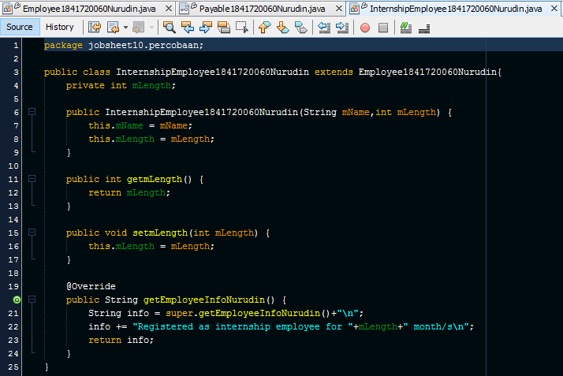

# Laporan Praktikum #10 - POLIMORFISME

## Kompetensi

1. Memahami konsep dan bentuk dasar polimorfisme
2. Memahami konsep virtual method invication
3. Menerapkan polimorfisme pada pembuatan heterogeneous collection
4. Menerapkan polimorfisme pada parameter/argument method
5. Menerapkan object casting untuk meng-ubah bentuk objek

## Ringkasan Materi

Polimorfisme merupakan kemampuan suatu objek untuk memiliki banyak bentuk. Penggunaan polimorfisme yang paling umum dalam OOP terjadi
ketika ada referensi super class yang digunakan untuk merujuk ke objek dari sub class. konsep polimorfisme bisa
diterapkan pada class-class yang memiliki relasi inheritance (relasi generalisasi atau IS-A).

>Virtual method Invocation

Virtual method invocation terjadi ketika ada pemanggilan overriding method dari suatu objek polimorfisme. Disebut virtual karena antara method yang dikenali oleh compiler dan method yang dijalankan oleh JVM berbeda.

>Heterogeneous Collection

Dengan adanya konsep polimorfisme, maka variabel array bisa dibuat heterogen. Artinya di dalam array tersebut bisa berisi berbagai macam objek yang berbeda. Contoh:
```java
Animal arr[] = new Animal[2];
arr[0] = new Deer();
arr[1] = new Lion();
```
>Polymorphic Argument

Polimorfisme juga bisa diterapkan pada argument suatu method. Tujuannya agar method tersebut bisa menerima nilai argument dari berbagai bentuk objek. Misalkan dibuat class baru sebagai berikut:
```java
    public class Human{
        public void drive(Animal anim){
            anim.walk();
        }
    }
```
Perhatikan method drive(), ia memiliki argument berupa Animal. Karena Animal memiliki subclass Lion dan Deer, maka method drive() tersebut akan bisa menerima argument berupa objek dari Deer maupun objek dari Lion.

>Operator instanceof
Operator instanceof bisa digunakan untuk mengecek apakah suatu objek merupakan hasil instansiasi dari suatu class tertentu. Hasil dari instanceof berupa nilai boolean. Misalkan dibuat objek d dan l.
```java
Deer d = new Deer();
Lion l = new Lion();
Animal a1 = d;
Animal a2 = l;
```
Jika kemudian digunakan operator instanceof, misalkan

```java
a1 instanceof Deer //akan menghasilkan true
```  

```java
a2 instanceof Lion //akan menghasilkan false
```  


>Object Casting

Casting objek digunakan untuk mengubah tipe dari suatu objek. Jika ada suatu objek dari subclass kemudian tipenya diubah ke superclass, maka hal ini termasuk ke upcasting. Contoh:
```java
Deer d = new Deer();
Animal a1 = d; // proses ini bisa disebut juga upcasting
```
Downcast terjadi jika ada suatu objek superclass, kemudian diubah menjadi
objek dari subclass. Contoh:

```java
Deer d = new Deer();
Animal a1 = d; // proses ini bisa disebut juga upcasting
Deer d = (Deer) a1; //proses downcasting
```

Proses downcasting sering disebut juga sebagai explicit casting, karena
bentuk tujuan dari casting harus dituliskan dalam tanda kurung di depan objek yang akan di-casting


## Percobaan
### Percobaan 1: Bentuk Dasar Polimorfisme

> Class Employee1841720060Nurudin


Link kode program : [kode program](../../src/10_Polimorfisme/percobaan/.java)

>Interface Payable1841720060Nurudin


Link kode program : [kode program](../../src/10_Polimorfisme/percobaan/Payable1841720060Nurudin.java)

>Class InternshipEmployee1841720060Nurudin



Link kode program : [kode program](../../src/10_Polimorfisme/percobaan/InternshipEmployee1841720060Nurudin.java)

>Class PermanentEmployee1841720060Nurudin


Link kode program : [kode program](../../src/10_Polimorfisme/percobaan/PermanentEmployee1841720060Nurudin.java)

>Class ElectricityBill1841720060Nurudin


Link kode program : [kode program](../../src/10_Polimorfisme/percobaan/ElectricityBill1841720060Nurudin.java)

>Class Tester1


Link kode program : [kode program](../../src/10_Polimorfisme/percobaan/Tester1.java)


#### Pertanyaan 
1. Class apa sajakah yang merupakan turunan dari class Employee?
2. Class apa sajakah yang implements ke interface Payable?
3. Perhatikan class Tester1, baris ke-10 dan 11. Mengapa e, bisa diisi dengan objek pEmp (merupakan objek dari class
PermanentEmployee) dan objek iEmp (merupakan objek dari class
InternshipEmploye) ?
4. Perhatikan class Tester1, baris ke-12 dan 13. Mengapa p, bisa diisi
dengan objek pEmp (merupakan objek dari class
PermanentEmployee) dan objek eBill (merupakan objek dari class
ElectricityBill) ?
5. Coba tambahkan sintaks:
    ```java
        p = iEmp;
        e = eBill;
    ```
    pada baris 14 dan 15 (baris terakhir dalam method main) ! Apa yang
menyebabkan error?
6. Ambil kesimpulan tentang konsep/bentuk dasar polimorfisme!


**Jawab**

1. class InternshipEmployee1841720060Nurudin dan PermanentEmployee1841720060Nurudin
2. class PermanentEmployee1841720060Nurudin dan ElectricityBill1841720060Nurudin
3. Karena e merupakan superclass dari objek pEmp dan iEmp (Object casting)
4. Karena p memiliki tipe Payable1841720060Nurudin, dan class dari objek pEmp dan eBill implement terhadap class Payable1841720060Nurudin 
5. Penyebab error adalah class dari object iEmp tidak implement terhadap class Payable1841720060Nurudin dimana p merupakan variable dengan tipe Payable1841720060Nurudin dan object eBill tidak memiliki relasi (inheritance) dengan class Employee1841720060Nurudin dimana e memiliki tipe Employee1841720060Nurudin 
6. Untuk dapat menerapkan konsep dasar polimorfisme class yang bersangkutan harus memiliki relasi berupa is-a 

### Percobaan 2: Virtual Method invocation

>Class Tester2


Link kode program : [kode program](../../src/10_Polimorfisme/percobaan/Tester2.java)


#### Pertanyaan
1. Perhatikan class Tester2 di atas, mengapa pemanggilan e.getEmployeeInfo() pada baris 8 dan pEmp.getEmployeeInfo() pada baris 10 menghasilkan hasil sama?
2. Mengapa pemanggilan method e.getEmployeeInfo() disebut sebagai pemanggilan method virtual (virtual method invication), sedangkan pEmp.getEmployeeInfo() tidak?
3. Jadi apakah yang dimaksud dari virtual method invocation? Mengapa disebut virtual?

**Jawab**

1. Karena pada baris sebelumnya terdapat sintaks **e = pEmp** sehingga atribut e bernilai objek pEmp
2. Saat compile time, compiler akan mengenali method getEmployeeInfoNurudin() yang akan dipanggil adalah method milik class Employee1841720060Nurudin, karena objek e bertipe Employee. Tetapi saat dijalankan yang dijalankan oleh
JVM justru method getEmployeeInfoNurudin() yang ada di class PermanentEmployee1841720060Nurudin
3. Virtual Method Invication adalah proses memanggil method subclass menggunakan objek superclass

### Percobaan 3: Heterogenous Collection

>Class Tester3


Link kode program : [kode program](../../src/10_Polimorfisme/percobaan/Tester3.java)

#### Pertanyaan 

1. Perhatikan array e pada baris ke-8, mengapa ia bisa diisi dengan objek-objek dengan tipe yang berbeda, yaitu objek pEmp (objek dari PermanentEmployee) dan objek iEmp (objek dari InternshipEmployee) ?
2. Perhatikan juga baris ke-9, mengapa array p juga biisi dengan objekobjek dengan tipe yang berbeda, yaitu objek pEmp (objek dari
PermanentEmployee) dan objek eBill (objek dari ElectricityBilling) ?
3. Perhatikan baris ke-10, mengapa terjadi error?

**Jawab**

1. Karena array e memiliki tipe Employee1841720060Nurudin dimana class dari objek pEmp dan iEmp merupakan turunan dari class Employee1841720060Nurudin
2. Karena array p memiliki tipe Payable1841720060Nurudin dimana class dari objek pEmp dan eBill implement terhadap Payable1841720060Nurudin
3. Karena di dalam elemen array terdapat objek eBill yang bukan merupakan turunan dari class Employee1841720060Nurudin 

### Percobaan 4: Argumen polimorfisme, instanceof dan casting objek


>Class Owner1841720060Nurudin


Link kode program : [kode program](../../src/10_Polimorfisme/percobaan/Owner1841720060Nurudin.java)

>Class Tester4


Link kode program : [kode program](../../src/10_Polimorfisme/percobaan/Tester4.java)

#### Pertanyaan

1. Perhatikan class Tester4 baris ke-7 dan baris ke-11, mengapa pemanggilan ow.pay(eBill) dan ow.pay(pEmp) bisa dilakukan, padahal jika diperhatikan method pay() yang ada di dalam class Owner memiliki argument/parameter bertipe Payable? Jika diperhatikan lebih detil eBill merupakan objek dari ElectricityBill dan pEmp merupakan objek dari PermanentEmployee?
2. Jadi apakah tujuan membuat argument bertipe Payable pada method pay() yang ada di dalam class Owner?
3. Coba pada baris terakhir method main() yang ada di dalam class Tester4 ditambahkan perintah ow.pay(iEmp); Mengapa terjadi error?

    

4. Perhatikan class Owner, diperlukan untuk apakah sintaks p instanceof ElectricityBill pada baris ke-6 ?
5. Perhatikan kembali class Owner baris ke-7, untuk apakah casting objek disana (ElectricityBill eb = (ElectricityBill) p) diperlukan ? Mengapa objek p yang bertipe Payable harus di-casting ke dalam objek eb yang bertipe ElectricityBill ?

**Jawab**

1.  Karena pada class ElectricityBill1841720060Nurudin dan PermanentEmployee1841720060Nurudin implement terhadap interface Payable1841720060Nurudin kemudian dalam method payNurudin() terdapat argument instanceof untuk membedakan atau mengecek inputan dari parameter method merupakan instansiasi objek dari class ElectricityBill1841720060Nurudin atau class PermanentEmployee1841720060Nurudin. Kemudian dilakukan downcasting dari p (parameter method bertipe Payable1841720060Nurudin) ke tipe subclassnya sehingga method payNurudin() dapat diinputkan objek dari class ElectricityBill1841720060Nurudin dan PermanentEmployee1841720060Nurudin
2. Agar class turunannya atau yang implement terhadap Payable1841720060Nurudin  dapat mengakses method tersebut
3. Karena class dari objek iEmp tidak implement terhadap Payable1841720060Nurudin
4. Melakukan pengecekan apakah parameter yang diinputkan merupakan instansiasi dari class ElectricityBill1841720060Nurudin. Jika ya akan bernilai true, jika salah bernilai false
5. casting pada baris tersebut untuk mengubah p yang bertipe Payable1841720060Nurudin menjadi ElectricityBill1841720060Nurudin sehingga meski nantinya inputan parameter method bertipe ElectricityBill1841720060Nurudin dapat diproses seolah bertipe Payable1841720060Nurudin

## Tugas

Dalam suatu permainan, Zombie dan Barrier bisa dihancurkan oleh Plant dan
bisa menyembuhkan diri. Terdapat dua jenis Zombie, yaitu Walking Zombie
dan Jumping Zombie. Kedua Zombie tersebut memiliki cara penyembuhan
yang berbeda, demikian juga cara penghancurannya, yaitu ditentukan oleh
aturan berikut ini:
- Pada WalkingZombie
    - Penyembuhan : Penyembuhan ditentukan berdasar level zombie yang bersangkutan
        - Jika zombie level 1, maka setiap kali penyembuhan, health akan bertambah 20%
        - Jika zombie level 2, maka setiap kali penyembuhan, health akan bertambah 30%
        - Jika zombie level 3, maka setiap kali penyembuhan, health akan bertambah 40%
    - Penghancuran : setiap kali penghancuran, health akan berkurang 20%
- Pada Jumping Zombie
    - Penyembuhan : Penyembuhan ditentukan berdasar level zombie yang bersangkutan
        - Jika zombie level 1, maka setiap kali penyembuhan,
health akan bertambah 30%
        - Jika zombie level 2, maka setiap kali penyembuhan,
health akan bertambah 40%
        - Jika zombie level 3, maka setiap kali penyembuhan,
health akan bertambah 50%
    - Penghancuran : setiap kali penghancuran, health akan berkurang 10% Buat program dari class diagram di bawah ini!

>Diagram UML


>Contoh class tester


>Output yang dihasilkan


**Jawab**

>Class Zombie1841720060Nurudin


Link kode program : [kode program](../../src/10_Polimorfisme/tugas/Zombie1841720060Nurudin.java)

>Interface IDestroyable1841720060Nurudin


Link kode program : [kode program](../../src/10_Polimorfisme/tugas/IDestroyable1841720060Nurudin.java)

>Class WalkingZombie1841720060Nurudin


Link kode program : [kode program](../../src/10_Polimorfisme/tugas/WalkingZombie1841720060Nurudin.java)

>Class JumpingZombie1841720060Nurudin


Link kode program : [kode program](../../src/10_Polimorfisme/tugas/JumpingZombie1841720060Nurudin.java)

>Class Barrier1841720060Nurudin


Link kode program : [kode program](../../src/10_Polimorfisme/tugas/Barrier1841720060Nurudin.java)

>Class Plant1841720060Nurudin


Link kode program : [kode program](../../src/10_Polimorfisme/tugas/Plant1841720060Nurudin.java)

>Class Tester1841720060Nurudin 


Link kode program : [kode program](../../src/10_Polimorfisme/tugas/Tester1841720060Nurudin.java)

## Kesimpulan

Dari hasil percobaan dan tugas disimpulkan bahwa polimorfisme dalam PBO dapat diterapkan pada class - class yang memiliki relas IS-A atau inheritance. Selain inheritance, polimorfisme umumnya juga digunakan pada class yang implement terhadap suatu interface. Dalam percobaan juga dilakukan referensi suatu objek dari satu class ke class lain, dimana referensi objek hanya dapat dilakukan oleh objek yang memiliki superclass atau implement ke suatu interface yang sama.

Penerapan polimorfisme juga bisa diterapkan pada suatu method dalam class. Meskipun class tersebut tidak memiliki relasi inheritance ataupun implement terhadap suatu interface Metode ini disebut virtual method invication

## Pernyataan Diri

Saya menyatakan isi tugas, kode program, dan laporan praktikum ini dibuat oleh saya sendiri. Saya tidak melakukan plagiasi, kecurangan, menyalin/menggandakan milik orang lain.

Jika saya melakukan plagiasi, kecurangan, atau melanggar hak kekayaan intelektual, saya siap untuk mendapat sanksi atau hukuman sesuai peraturan perundang-undangan yang berlaku.

Ttd,

***(Mukhammad Nuruddin Ismail)***
