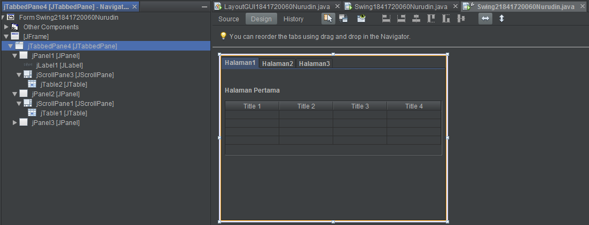

# Laporan Praktikum #10 - GUI (Graphical User Interface)

## Kompetensi

1. Membuat aplikasi Graphical User Interface sederhana dengan bahasa pemrograman java;
2. Mengenal komponen GUI seperti frame, label, textfield, combobox, radiobutton, checkbox, textarea, menu, serta table;
3. Menambahkan event handling pada aplikasi GUI.

## Ringkasan Materi

Agar interaksi antara user dengan program tidak membosankan diperlukanlah sebuah interface yang menghubungkan antara user dengan program dengan tampilan grafis, interface ini dinamakan dengan GUI(Graphical User Interface). Tidak seperti interfaces yang berbasis console, GUI lebih user friendly dan jauh lebih nyaman digunakan. Meski dalam perbandingan performa, UI console relatif lebih cepat karena tidak memuat komponen - komponen grafis. Dalam pemrograman GUI terdapat beberapa bagian yang harus dilakukan yaitu:

1. Membuat windows utama
2. Menentukan komponen-komponen pendukung program
3. Menentukan tata letak layout agar nantinya semua komponen – komponen yang sudah dipersiapkan bisa diaatur sedemikian rupa
4. Event Handling dari sebuah aktivitas, seperti penekanan button, check box dan lain-lain

Java Swing merupakan bagian dari JFC (Java Foundation Classes) yang menyediakan API untuk menangani hal yang berkaitan dengan GUI bagi program Java. Swing sendiri masih turunan dari komponen - komponen AWT yang lebih modern, sehingga dalam penggunaan Swing, masih berkaitan dengan AWT. Kita bisa membedakan komponen Swing dengan komponen AWT, di mana pada umumnya kelas-kelas yang berada dalam komponen Swing diawali dengan huruf J, misal: JButton, JLabel, JTextField, JRadioButton.

## Percobaan
### Percobaan 1: JFrame HelloGUI
Pada percobaan ini dilakukan pengenalan Java GUI, berupa pembuatan frame GUI menggunakan Java Swing

> Class HelloGui1841720060Nurudin


Link kode program : [kode program](../../src/10_Polimorfisme/percobaan/HelloGui1841720060Nurudin.java)

### Percobaan 2: Menangani Input Pada GUI
Pada percobaan ini dilakukan pemrosesan inputan oleh user agar dapat menghasilkan suatu output yang diinginkan.

> Class MyInputForm1841720060Nurudin


Link kode program : [kode program](../../src/11_GUI/percobaan/MyInputForm1841720060Nurudin.java)

> Class mainPercobaan21841720060Nurudin


Link kode program : [kode program](../../src/11_GUI/percobaan/mainPercobaan21841720060Nurudin.java)

> Output Main


#### Pertanyaan 
1.  Modifikasi kode program dengan menambahkan JButton baru untuk melakukan fungsi perhitungan penambahan, sehingga ketika button di klik (event click) maka akan menampilkan hasil penambahan dari nilai A dan B

#### Jawab
1. Pada class MyInputForm1841720060Nurudin dilakukan modifikasi berupa :
    - penambahan JButton dengan nama btn
    - modifikasi pada method createButtonNurudin berupa instansiasi **btn** dan penambahan class **Tambah** serta penambahan actionListener untuk **btn**
    - melakukan fungsi add pada panel untuk komponen **btn** dalam Method createPanelNurudin()

    Source Code :

    ```java
    package jobsheet11.percobaan2.inputGui;

    import java.awt.event.ActionEvent;
    import java.awt.event.ActionListener;
    import javax.swing.*;

    public class MyInputForm1841720060Nurudin extends JFrame {

        private static final int FRAME_WIDTH = 600;
        private static final int FRAME_HEIGHT = 200;
        private JLabel aLabel;
        private JLabel bLabel;
        private JLabel cLabel;
        private JTextField aField;
        private JTextField bField;
        private JButton button;
        private JButton btn;
        private JPanel panel;

        public MyInputForm1841720060Nurudin() {
            createTextFieldNurudin();
            createButtonNurudin();
            createPanelNurudin();
            setSize(FRAME_WIDTH, FRAME_HEIGHT);
        }

        private void createTextFieldNurudin() {
            aLabel = new JLabel("Nilai A: ");
            bLabel = new JLabel("Nilai C: ");
            cLabel = new JLabel("Hasil : ");

            final int FIELD_WIDTH = 10;
            aField = new JTextField(FIELD_WIDTH);
            aField.setText("0");
            bField = new JTextField(FIELD_WIDTH);
            bField.setText("0");
        }

        private void createButtonNurudin() {
            button = new JButton("Calculate");
            btn = new JButton("SUM");
            class AddInterestListener implements ActionListener {

                public void actionPerformed(ActionEvent event) {
                    int a = Integer.valueOf(aField.getText());
                    int b = Integer.valueOf(bField.getText());
                    int c = a * b;
                    cLabel.setText("Hasil = " + c);
                }
            }
        
            class Tambah implements ActionListener {
                public void actionPerformed(ActionEvent event) {
                    int a = Integer.valueOf(aField.getText());
                    int b = Integer.valueOf(bField.getText());
                    int c = a + b;
                    cLabel.setText("Hasil = " + c);
                }
            }
            ActionListener tambah = new Tambah();
            btn.addActionListener(tambah);
            
            ActionListener listener = new AddInterestListener();
            button.addActionListener(listener);
        }

        private void createPanelNurudin() {
            panel = new JPanel();
            panel.add(aLabel);
            panel.add(aField);
            panel.add(bField);
            panel.add(bField);
            panel.add(button);
            panel.add(btn);
            panel.add(cLabel);
            add(panel);
        }
    }
   
    ```

    Output :

    

### Percobaan 3: Manajemen Layout
Pada percobaan ini dilakukan pengenalan macam - macam layout yang bisa diaplikasikan pada Java GUI, yaitu berupa Box, Border, dan Grid

> Class Border1841720060Nurudin


Link kode program : [kode program](../../src/11_GUI/percobaan/Border1841720060Nurudin.java)

> Class Box1841720060Nurudin


Link kode program : [kode program](../../src/11_GUI/percobaan/Box1841720060Nurudin.java)

> Class Grid1841720060Nurudin


Link kode program : [kode program](../../src/11_GUI/percobaan/Grid1841720060Nurudin.java)

> Class LayoutGUI1841720060Nurudin


Link kode program : [kode program](../../src/11_GUI/percobaan/LayoutGUI1841720060Nurudin.java)

> Output Border


> Output Box


> Output Grid


#### Pertanyaan 
1. Apa perbedaan dari Grid Layout, Box Layout dan Border Layout?
2. Apakah fungsi dari masing-masing kode berikut?
    ```java
        JFrame frame = new Border1841720060Nurudin();
        frame.setDefaultCloseOperation(JFrame.EXIT_ON_CLOSE);
        frame.setVisible(true);

        JFrame frame2 = new Grid1841720060Nurudin();
        frame2.setDefaultCloseOperation(JFrame.EXIT_ON_CLOSE);
        frame2.setVisible(true);

        JFrame frame3 = new Box1841720060Nurudin();
        frame3.setDefaultCloseOperation(JFrame.EXIT_ON_CLOSE);
        frame3.setVisible(true);
    ```
#### Jawab

1. - Pada grid layout pengaturan posisi komponen mirip seperti array dua dimensi, dapat ditentukan banyak baris dan kolom untuk memenuhi frame.
    - Pada Box layout, ukuran komponen tidak bergantung pada frame luarnya dan pengaturan untuk posisinya terdapat Y_AXIS & PAGE_AXIS (vertical), X_AXIS & TEXT_AXIS (horizontal)  
2. Jawaban berupa comment :

    ```java
        //instansiasi object frame dari class Border1841720060Nurudin
        JFrame frame = new Border1841720060Nurudin();
        //pengaturan ketika window di close maka akan melakukan exit
        frame.setDefaultCloseOperation(JFrame.EXIT_ON_CLOSE);
        //Agar output tampil ketika di eksekusi 
        frame.setVisible(true);

        //instansiasi object frame2 dari class Border1841720060Nurudin
        JFrame frame2 = new Grid1841720060Nurudin();
        //pengaturan ketika window di close maka akan melakukan exit
        frame2.setDefaultCloseOperation(JFrame.EXIT_ON_CLOSE);
        //Agar output tampil ketika di eksekusi
        frame2.setVisible(true);

        //instansiasi object frame3 dari class Border1841720060Nurudin
        JFrame frame3 = new Box1841720060Nurudin();
        //pengaturan ketika window di close maka akan melakukan exit
        frame3.setDefaultCloseOperation(JFrame.EXIT_ON_CLOSE);
        //Agar output tampil ketika di eksekusi
        frame3.setVisible(true);
    ```

### Percobaan 4: Membuat GUI Melalui IDE Netbeans
Pada percobaan ini dilakukan pembuatan aplikasi Java GUI dengan metode drag & drop menggunakan IDE Netbeans

> Design Swing1841720060Nurudin


Link kode program : [kode program](../../src/11_GUI/percobaan/Swing1841720060Nurudin.java)

> Output Swing1841720060Nurudin


#### Pertanyaan 
1. Apakah fungsi dari kode berikut?
    ```java
        java.awt.EventQueue.invokeLater(new Runnable() {
            public void run() {
                new Swing1841720060Nurudin().setVisible(true);
            }
        });
    ```
2. Mengapa pada bagian logika checkbox dan radio button digunakan multiple if ?
3. Lakukan modifikasi pada program untuk melakukan menambahkan inputan berupa alamat dan berikan fungsi pemeriksaan pada nilai Alamat tersebut jika belum diisi dengan menampilkan pesan peringatan  

#### Jawab
1. fungsi dari kode diatas adalah untuk membuat dan menampilkan form
2. Agar jika checkbox dan radio button di select semua, dapat menampilkan masing-masing value dari komponen tersebut
3. - Pada design menambahkan palette jTextArea (variable name : taAlamat) dan jLabel (text : Alamat).
    - Menambahkan variable mAlamat dengan tipe data String dan access modifier private pada class Swing1841720060Nurudin
    - Modifikasi method btTampilActionPerformed menjadi :

    ```java
    private void btTampilActionPerformed(java.awt.event.ActionEvent evt) {                                         
        mNama = txtNama.getText();
        mNim = txtNim.getText();
        if (cbMK1.isSelected()) {
            mMatakuliah = "Sistem Terdistribusi";
        }
        if (cbMK2.isSelected()) {
            mMatakuliah += "PBO";
        }

        if (rbLaki.isSelected()) {
            mJenisKelamin = "Laki - Laki";
        }
        if (rbPerempuan.isSelected()) {
            mJenisKelamin += "Perempuan";
        }

        mJurusan = jlJurusan.getSelectedValue().toString();
        mSemester = cbSemester.getSelectedItem().toString();

        //pemberian alamat, wajib diisi. Jika tidak muncul message error
        mAlamat = taAlamat.getText();
        if (mAlamat.isEmpty()) {
            JOptionPane.showMessageDialog(null, "Alamat Harus diisi! ", "PERINGATAN!", JOptionPane.WARNING_MESSAGE);
        } else {
            mInfo = "Nama\t: " + mNama + "\n";
            mInfo += "NIM\t: " + mNim + "\n";
            mInfo += "Jenis Kelamin : " + mJenisKelamin + "\n";
            mInfo += "Jurusan\t: " + mJurusan + "\n";
            mInfo += "Semester\t: " + mSemester + "\n";
            mInfo += "Mata Kuliah\t: " + mMatakuliah + "\n";
            mInfo += "Alamat\t: " + mAlamat + "\n";
            hasil.setText(mInfo);
            JOptionPane.showMessageDialog(null, mInfo);
        }
    }                       
    ```
    > Output program setelah dilakukan penambahan komponen alamat dan modifikasi method
    - Ketika Alamat tidak diisi

    

    - Ketika alamat sudah diisi

    

### Percobaan 5: JTabPane, JTtree, JTable
Pada percobaan ini dilakukan pembuatan aplikasi Java GUI menggunakan komponen JtabPane, JTtree, dan JTable 

> Design Swing21841720060Nurudin


Link kode program : [kode program](../../src/11_GUI/percobaan/Swing21841720060Nurudin.java)

> Output Swing21841720060Nurudin


#### Pertanyaan 
1. Apa kegunaan komponen swing JTabPane, JTtree, pada percobaan 5?
2. Modifikasi program untuk menambahkan komponen JTable pada tab Halaman 1 dan tab Halaman 2

#### Jawab
1. JTabPane digunakan untuk membuat lebih dari 1 panel dalam sebuah window, JTtree digunakan untuk membuat atau menampilkan hirarki struktur data atau direktori
2. Pada tab Halaman 2 sudah terdapat komponen JTable sehingga pada pertanyaan ini hanya dilakukan penambahan JTable pada panel halaman 1. Dengan cara melakukan drag & drop komponen table pada palette di bagian design, ke panel halaman 1

    


## Tugas
Buatlah Sebuah Program yang mempunyai fungsi seperti kalkulator (mampu menjumlahkan, mengurangkan, mengalikan dan membagikan. Dengan tampilan seperti berikut.


### Jawab
> Design Calculator1841720060Nurudin


Link kode program : [kode program](../../src/11_GUI/tugas/Calculator1841720060Nurudin.java)

> Output Calculator1841720060Nurudin


## Kesimpulan

Dari percobaan yang telah saya lakukan, dapat disimpulkan bahwa :
- Untuk membuat aplikasi berbasis GUI pada Java dapat menggunakan komponen milik Java Swing dan AWT. Dimana Pada Java Swing tampilan komponen - komponennya lebih modern dibanding AWT
- Komponen utama pada GUI di java yaitu penggunaan Frame (JFrame pada Swing) sebagai kontainer dari semua komponen - komponen yang akan dimuat dalam aplikasi. Frame bisa disebut juga window
- Dalam Java GUI terdapat 3 buah layout model yaitu box, border, dan grid
- Selain menggunakan native programming, untuk membuat tampilan GUI juga bisa dengan metode drag & drop menggunakan IDE Netbeans
- Hal yang terpenting dalam aplikasi GUI adalah penggunaan event yang menjembatani interaksi antara user dengan aplikasi. Tanpa adanya event, aplikasi GUI hanya berupa tampilan yang tidak melakukan penanganan proses dari inputan user


## Pernyataan Diri

Saya menyatakan isi tugas, kode program, dan laporan praktikum ini dibuat oleh saya sendiri. Saya tidak melakukan plagiasi, kecurangan, menyalin/menggandakan milik orang lain.

Jika saya melakukan plagiasi, kecurangan, atau melanggar hak kekayaan intelektual, saya siap untuk mendapat sanksi atau hukuman sesuai peraturan perundang-undangan yang berlaku.

Ttd,

***(Mukhammad Nuruddin Ismail)***
