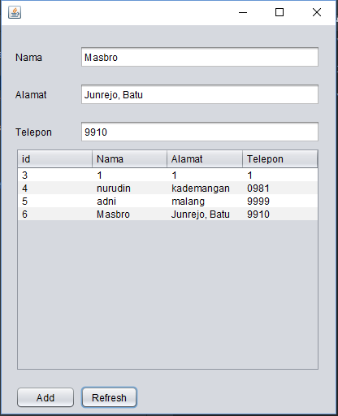

# Laporan Praktikum #12 - Collection (List, Set, Map) dan Database

## Kompetensi

1. Memahami cara penyimpanan objek menggunakan Collection dan Map.
2. Mengetahui pengelompokan dari Collection.
3. Mengetahui perbedaan dari interface Set, List dan Map.
4. Mengetahui penggunaan class-class dari interface Set, List, dan Map.
5. Memahami koneksi database menggunakan JDBC dan JDBC API

## Ringkasan Materi

Collection adalah suatu objek yang bisa digunakan untuk menyimpan sekumpulan objek. Objek yang ada dalam Collection disebut elemen. Collection menyimpan elemen yang bertipe Object, sehingga berbagai tipe object bisa disimpan dalam Collection. Class-class mengenai Collection tergabung dalam Java Collection Framework. Class-class Collection diletakkan dalam package java.util dan mempunyai dua interface utama yaitu Collection. Collection terbagi menjadi 3 kelompok yaitu

1. Set

Set mengikuti model himpunan, dimana objek/anggota yang tersimpan dalam Set harus unik. Urutan maupun letak dari anggota tidak penting, hanya keberadaan anggota saja yang penting. Kelas yang mengimplementasikan Set harus memastikan tidak ada elemen duplikat yang dapat ditambahkan ke dalam set. Class-Class yang mengimplementasikan interface Set adalah HashSet. HashSet dapat digunakan untuk menyimpan elemen-elemen yang tidak berduplikat. Kelas HashSet merupakan suatu kelas konkrit yang mengimplementasikan Set. Pembuatan objek HashSet adalah sebagai berikut:

    Set <nama_objek_HashSet> = new HashSet();

2. List
List digunakan untuk menyimpan sekumpulan objek berdasarkan urutan masuk (ordered) dan menerima duplikat. Cara penyimpanannya seperti array, oleh sebab itu memiliki posisi awal dan posisi akhir, menyisipkan objek pada posisi tertentu, mengakses dan menghapus isi list, dimana semua proses ini selalu didasarkan pada urutannya. Class-class yang mengimplementasikan interface List adalah Vector, Stack, Linked List dan Array List. Pada
jobsheet ini yang akan dibahas adalah ArrayList.

ArrayList digunakan untuk membuat array yang ukurannya dinamis. Berbeda dengan array biasa yang ukurannya harus ditentukan di awal deklarasi array, dengan ArrayList, ukurannya akan fleksibel tergantung banyaknya elemen yang dimasukkan. Pendeklarasian object ArrayList sebaiknya diikuti dengan nama class yang akan dimasukkan dalam List tersebut. Tujuannya agar method dan property dari setiap object dalam ArrayList dapat diakses secara langsung. Pembuatan objek ArrayList adalah sebagai berikut:

    ArrayList <nama_objek_arraylist>=new ArrayList();

3. Map
Perbedaaan mendasar map dengan collection yang lain, untuk menyimpan objek pada Map, perlu sepasang objek, yaitu key yang bersifat unik dan nilai yang disimpan. Untuk mengakses nilai tersebut maka kita perlu mengetahui key dari nilai tersebut. Map juga dikenal sebagai dictionary/kamus. Pada saat menggunakan kamus, perlu suatu kata yang digunakan untuk pencarian. Class-class yang mengimplementasikan Map adalah Hashtable,HashMap, LinkedHashMap. Pada jobsheet ini yang akan dibahas adalah HashMap.
HashMap adalah class implementasi dar Map, Map itu sendiri adalah interface yang memiliki fungsi untuk memetakan nilai dengan key unik. HashMap berfungsi sebagai memory
record management, dimana setiap record dapat disimpan dalam sebuah Map. kemudian setiap Map diletakkan pada vektor, list atau set yang masih turunan dari collection. Pembuatan objek HashMap adalah sebagai berikut:

    HashMap <nama_objek_HashMap> = new HashMap();

4. JDBC API
JDBC API merupakan Java Database Connectivity Application Programming Interface (JDBC API). Pada dasarnya JDBC API terdiri dari satu set kelas dan interface yang digunakan untuk berinteraksi dengan database dari aplikasi Java. Umumnya, JDBC API melakukan 3(tiga) fungsi berikut :
- Membangun koneksi antara aplikasi Java dan database
- Membangun dan mengeksekusi query
- Memproses hasil

## Percobaan
### Percobaan 1: Set
Pada percobaan ini dilakukan penggunaan Collection dari kelompok set menggunakan HashSet

> Class CobaHashSet1841720060Nurudin


Link kode program : [kode program](../../src/12_Java_API/CobaHashSet1841720060Nurudin.java)

#### Pertanyaan percobaan1
1. Apakah fungsi import java.util.*; pada program diatas!
2. Pada baris program keberapakah yang berfungsi untuk menciptakan object HashSet?
3. Apakah fungsi potongan program dibawah ini pada percobaan 1!
    ```java
        mSetCity.add("Malang");
        mSetCity.add("Banyuwangi");
        mSetCity.add("Yogyakarta");
        mSetCity.add("Batu");
    ```
4. Tambahkan set.add(“Malang”); kemudian jalankan program! Amati hasilnya dan jelaskan mengapa terjadi error!

5. Jelaskan fungsi potongan program dibawah ini pada percobaan 1!
    ```java
        Iterator<String> mIterator = mSetCity.iterator();
        
        while(mIterator.hasNext()){
            System.out.println(mIterator.next().toLowerCase());
        }
    ```
#### Jawab Pertanyaan percobaan1
1. Melakukan import (memanggil) semua framework yang terdapat dalam library / package java.util
2. Pada code program saya pembuatan object HashSet terdapat pada baris ke-8
3. Menambahkan value pada HashSet 
4. Error, jika set yang dimaksud pada soal adalah object mSetCity maka error karena "Malang" sudah terdapat dalam HashSet. 
5. Instansiasi object mIterator dari interfaces iterator (java framework). Kemudian melakukan iterasi (penelusuran) pada object mSetCity menggunakan fungsi dalam iterator

### Percobaan 2: List
Pada percobaan ini dilakukan penggunaan Collection dari kelompok list menggunakan ArrayList

> Class CobaArrayList1841720060Nurudin


Link kode program : [kode program](../../src/12_Java_API/CobaArrayList1841720060Nurudin.java)

#### Pertanyaan percobaan2
1. Apakah fungsi potongan program dibawah ini!
    ```java
        System.out.println(mListCountry);
        System.out.format("List index 0 = %s\n", mListCountry.get(0));
        System.out.format("List index 2 = %s\n", mListCountry.get(2));
    ```
2. Ganti potongan program pada soal no 1 menjadi sebagai berikut
    ```java
        System.out.println("Country List");
        Iterator mIterator = mListCountry.iterator();
        while(mIterator.hashNext()){
            Object element = mIterator.next();
            System.out.format("%s",element);
        }
    ```
3. Jelaskan perbedaan menampilkan data pada ArrayList menggunakan potongan program pada
soal no 1 dan no 2!

#### Jawab Pertanyaan percobaan2
1. Berfungsi untuk mengambil nilai dari arrayList pada index ke 0 dan 2
2. 
3. Pada soal no 1 akan menampilkan data berdasar nilai indexnya, sedangkan pada soal no 2 akan menampilkan semua data dalam arrayList yang ada menggunakan iterator

### Percobaan 3: Map
Pada percobaan ini dilakukan penggunaan Collection dari kelompok map menggunakan HashMap

> Class DemoHashMap1841720060Nurudin


Link kode program : [kode program](../../src/12_Java_API/DemoHashMap1841720060Nurudin.java)

#### Pertanyaan percobaan3
1. Jelaskan fungsi hMapItem.put("1","Biskuit") pada program!
2. Jelaskan fungsi hMapItem.size() pada program!
3. Jelaskan fungsi hMapItem.remove("1") pada program!
4. Jelaskan fungsi hMapItem.clear() pada program!
5. Tambahkan kode program yang di blok pada program yang sudah anda buat!
    ```java
        Collection mCollection = hMapItem.values();
        Iterator mIterator = mCollection.iterator();
        while (mIterator.hasNext()) {            
            System.out.println(mIterator.next());
        }
    ```
6. Jalankan program dan amati apa yang terjadi!
7. Apakah perbedaan program sebelumnya dan setelah ditambahkan kode program pada soal no 5 diatas? Jelaskan!

#### Jawab Pertanyaan percobaan2
1. Meletakkan value Biskuit dengan key 1 pada Map
2. Mengembalikan jumlah nilai key dalam Map
3. Menghapus item atau value yang memiliki key 1
4. Menghapus semua mapping dalam Map
5. 
6. 

    Penambahan output berupa iterasi dengan menampilkan semua element dalam Map
7. Pada kode program sebelumnya, untuk menampilkan element dalam map dengan menggunakan object hMapItem, Sehingga tampil value dan keynya. Sedangkan pada soal no 5 untuk menampilkan element menggunakan iterator sehingga hanya tampil valuenya saja

### Percobaan 4: Implementasi ArrayList dalam GUI

Pada percobaan ini dilakukan penggunaan Collection ArrayList menggunakan java GUI

> Class Mahasiswa1841720060Nurudin


Link kode program : [kode program](../../src/12_Java_API/Mahasiswa1841720060Nurudin.java)

> Class InputData1841720060Nurudin


Link kode program : [kode program](../../src/12_Java_API/InputData1841720060Nurudin.java)

> Form TampilGUI1841720060Nurudin


Link kode program : [kode program](../../src/12_Java_API/TampilGUI1841720060Nurudin.java)

> Output Form TampilGUI1841720060Nurudin


### Percobaan 5: Aplikasi Biodata
Pada percobaan ini dilakukan pembuatan form biodata berupa nama, alamat dan, telepon melalui java GUI yang direlasikan dengan database MySQL menggunakan JDBC

> Form FormKoneksi1841720060Nurudin


Link kode program : [kode program](../../src/12_Java_API/FormKoneksi1841720060Nurudin.java)

> Output Form TampilGUI1841720060Nurudin



#### Pertanyaan percobaan5

1. Setelah menambah code pada action button klik, coba jalankan program dan tambahkan data. Apakah program berhasil menambahkan data? Jika tidak apakah penyebabnya.
2. ```java
    bukaKoneksiNurudin();
    String sqlkode="Insert into anggota (nama,alamat,telp) "
    + "values ('"+this.jTFNama.getText()+"',"
    + "'"+this.jTFAlamat.getText()+"',"
    + "'"+this.jTFTelepon.getText()+"')";
    try {
        PreparedStatement mStatement = koneksi.prepareStatement(sqlkode);
        mStatement.executeUpdate();
        mStatement.close();
        JOptionPane.showMessageDialog(this,"Data Berhasil Ditambah");
    } catch (SQLException ex) {
        JOptionPane.showMessageDialog(this,"Terjadi Kesalahan "+ex.getMessage());
    }
    ```
    Jelaskan maksud source code untuk melakukan insert data diatas?
3. Jelaskan alur dari method ambilDataTabelNurudin()
4. Buat fungsi untuk merefresh sehingga data yang baru dapat ditampilkan pada tabel.

#### Jawab Pertanyaan percobaan5
1. Berhasil ditambahkan dalam database tetapi tidak muncul dalam table aplikasi karena table dalam program belum didefinisikan untuk menampilkan data dari database
2. Button add melakukan event ketika di klik. yaitu :
    1. Memanggil method bukaKoneksiNurudin(); untuk melakukan koneksi pada database
    2. Menyimpan query insert data berupa nama,alamat,dan telepon dalam variable sqlkode
    3. Membuat statement dari koneksi yang telah dibuat berupa query insert pada variable sqlkode
    4. Mengeksekusi statement dalam sqlkode
    5. Menutup statement yang telah dieksekusi
    6. Menampilkan pesan apakah statement berhasil di eksekusi atau tidak
3. Alur dari methode ambilDataTabelNurudin() yaitu :
    1. Mengosongkan semua row yang terdapat dalam tabel
    2. Mengeset tabel bahwa data didalamnya dapat diubah
    3. Melakukan koneksi pada database
    4. Membuat statement dari koneksi yang telah dibuat
    5. Membuat query untuk menampilkan semua data dalam database dan menyimpannya pada variabel sql
    6. Mengeksekusi query sql
    7. Menyimpan setiap data dalam database kedalam kedalam array object
    8. Menambahkan values dalam array object ke dalam row table.
4. Untuk membuat fungsi refresh sehingga data yang baru dapat ditampilkan dapat dilakukan dengan mengklik dua kali pada button refresh, kemudian memanggil method ambilDataTabel() dalam event button tsb.    

## Kesimpulan

Collection dalam java terdiri dari 3 jenis yaitu Set, List, dan Map dimana masing-masing jenis memiliki karakteristik tersendiri. Semisal dalam penggunaan Set tidak diperbolehkan terdapat value yang duplikat (Case Sensitive), sedangkan pada list dan map tidak masalah jika terdapat data yang terdupikat. List (arrayList) menyimpan data berdasar index, sedangkan map berdasar key.

Untuk membuat koneksi dalam java dengan rdms MySQL membutuhkan driver atau librari yaitu JDBC. Secara sederhana untuk melakukan koneksi antara keduanya dapat dilakukan dengan 

```java
    Class.forName("com.mysql.jdbc.Driver");
    //url,username,password
    conn = DriverManager.getConnection("jdbc:mysql://localhost:3306/", "root", "");
    state = conn.createStatement();
```

## Pernyataan Diri

Saya menyatakan isi tugas, kode program, dan laporan praktikum ini dibuat oleh saya sendiri. Saya tidak melakukan plagiasi, kecurangan, menyalin/menggandakan milik orang lain.

Jika saya melakukan plagiasi, kecurangan, atau melanggar hak kekayaan intelektual, saya siap untuk mendapat sanksi atau hukuman sesuai peraturan perundang-undangan yang berlaku.

Ttd,

***(Mukhammad Nuruddin Ismail)***
