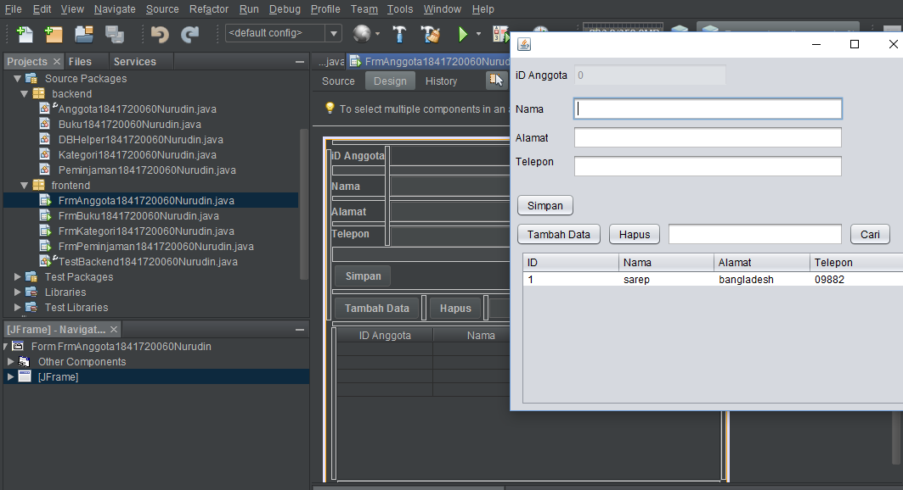

# Laporan Praktikum #14 - Database dan GUI

## Kompetensi

1. Menggunakan paradigma berorientasi objek untuk interaksi dengan database
2. Membuat backend dan frontend
3. Membuat form sebagai frontend

## Pendahuluan

Kali ini kita akan menggunakan paradigma berorientasi objek yang telah kita pelajari untuk membuat aplikasi berbasis database dan dilengkapi dengan form sebagai Graphical User Interface (GUI).
Secara umum, tahapan yang akan kita lakukan adalah sebagai berikut:
1. Membuat database dan tabel-tabelnya.
2. Membuat backend yang berisi class-class yang mewakili data yang ada pada database, dan class helper untuk melakukan eksekusi query database.
3. Membuat frontend yang merupakan antarmuka kepada pengguna. Frontend ini bisa berbasis teks (console), GUI, web, mobile, dan sebagainya.
Library yang digunakan untuk project ini antara lain:
1. JDBC, untuk melakukan interaksi ke database.
2. ArrayList, untuk menampung data hasil query ke database.
3. Swing, untuk membuat tampilan GUI.
Untuk percobaan, kita akan membuat sistem informasi Perpustakaan, yang memiliki data antara lain: Buku, Kategori, Anggota dan Peminjaman. Fitur yang ada pada aplikasi ini adalah anggota dapat melakukan peminjaman dan pengembalian buku. Berikut adalah class diagram untuk sistem informasi ini:


Dapat dilihat dari class diagram diatas, terdapat relasi antar class. Class Buku berelasi dengan Kategori dikarenakan terdapat atribut bertipe data Kategori di dalam class buku. Begitu juga class Peminjaman yang berelasi dengan class Buku dan Anggota.

## Percobaan
### Percobaan 1: Membuat Database

Membuat database sesuai dengan gambar pada bagian pendahuluan


### Percobaan 2: Mempersiapkan project
Membuat project baru pada java netbeans dengan nama project perpustakaan. Kemudian menambahkan library MySQL JDBC Driver pada bagian library. Lalu membuat dua buah package, beri nama masing-masing package yaitu frontend dan backend


### Percobaan 3: Membuat class helper untuk mengeksekusi query SQL.
Membuat class DBHelper1841720060Nurudin pada package backend yang berisi method untuk mengatur koneksi antara program dengan database mysql
> Class DBHelper1841720060Nurudin
```java
/*
 * To change this license header, choose License Headers in Project Properties.
 * To change this template file, choose Tools | Templates
 * and open the template in the editor.
 */
package backend;

import java.sql.*;

/**
 *
 * @author personal
 */
public class DBHelper1841720060Nurudin {

    private static Connection koneksi;

    public static void bukaKoneksiNurudin() {
        if (koneksi == null) {
            try {
                String url = "jdbc:mysql://localhost:3306/dbperpus";
                String user = "root";
                String password = "";
                DriverManager.registerDriver(new com.mysql.jdbc.Driver());
                koneksi = DriverManager.getConnection(url, user, password);
            } catch (SQLException t) {
                System.out.println("Error koneksi!");
            }
        }
    }

    public static int insertQueryGetIdNurudin(String query) {
        bukaKoneksiNurudin();
        int num = 0;
        int result = -1;
        try {
            Statement stmt = koneksi.createStatement();
            num = stmt.executeUpdate(query, Statement.RETURN_GENERATED_KEYS);
            ResultSet rs = stmt.getGeneratedKeys();
            if (rs.next()) {
                result = rs.getInt(1);
            }
            rs.close();
            stmt.close();
        } catch (Exception e) {
            e.printStackTrace();
            result = -1;
        }
        return result;
    }

    public static boolean executeQueryNurudin(String query) {
        bukaKoneksiNurudin();
        boolean result = false;
        try {
            Statement stmt = koneksi.createStatement();
            stmt.executeUpdate(query);
            result = true;
            stmt.close();
        } catch (Exception e) {
            e.printStackTrace();
        }
        return result;
    }

    public static ResultSet selectQueryNurudin(String query) {
        bukaKoneksiNurudin();
        ResultSet rs = null;
        try {
            Statement stmt = koneksi.createStatement();
            rs = stmt.executeQuery(query);
        } catch (Exception e) {
            e.printStackTrace();
        }
        return rs;
    }
}
```

Link file kode program : [kode program](../../src/14_GUI_dan_Database/backend/DBHelper1841720060Nurudin.java)

### Percobaan 4: Membuat Class Kategori1841720060Nurudin
Class ini berisi method-method yang digunakan untuk menghandle CRUD pada aplikasi project
> Class Kategori1841720060Nurudin
```java
/*
 * To change this license header, choose License Headers in Project Properties.
 * To change this template file, choose Tools | Templates
 * and open the template in the editor.
 */
package backend;

import java.util.ArrayList;
import java.sql.*;
import backend.*;

/**
 *
 * @author peronal
 */
public class Kategori1841720060Nurudin {

    private int mIdKategori;
    private String mNama;
    private String mKeterangan;

    public int getIdKategori() {
        return mIdKategori;
    }

    public void setIdKategori(int mIdKategori) {
        this.mIdKategori = mIdKategori;
    }

    public String getNama() {
        return mNama;
    }

    public void setNama(String mNama) {
        this.mNama = mNama;
    }

    public String getKeterangan() {
        return mKeterangan;
    }

    public void setKeterangan(String mKeterangan) {
        this.mKeterangan = mKeterangan;
    }

    public Kategori1841720060Nurudin() {
    }

    public Kategori1841720060Nurudin(String mNama, String mKeterangan) {
        this.mNama = mNama;
        this.mKeterangan = mKeterangan;
    }

    public Kategori1841720060Nurudin getByIdNurudin(int id) {
        Kategori1841720060Nurudin kat = new Kategori1841720060Nurudin();
        ResultSet rs = DBHelper1841720060Nurudin.selectQueryNurudin("SELECT * FROM kategori " + " WHERE idkategori = '" + id + "'");

        try {
            while (rs.next()) {
                kat = new Kategori1841720060Nurudin();
                kat.setIdKategori(rs.getInt("idkategori"));
                kat.setNama(rs.getString("nama"));
                kat.setKeterangan(rs.getString("keterangan"));
            }
        } catch (Exception e) {
            e.printStackTrace();
        }
        return kat;
    }

    public ArrayList<Kategori1841720060Nurudin> getAllNurudin() {
        ArrayList<Kategori1841720060Nurudin> ListKategori = new ArrayList();

        ResultSet rs = DBHelper1841720060Nurudin.selectQueryNurudin("SELECT * FROM kategori");

        try {
            while (rs.next()) {
                Kategori1841720060Nurudin kat = new Kategori1841720060Nurudin();
                kat.setIdKategori(rs.getInt("idkategori"));
                kat.setNama(rs.getString("nama"));
                kat.setKeterangan(rs.getString("keterangan"));

                ListKategori.add(kat);
            }
        } catch (Exception e) {
            e.printStackTrace();
        }

        return ListKategori;
    }

    public ArrayList<Kategori1841720060Nurudin> searchNurudin(String keyword) {
        ArrayList<Kategori1841720060Nurudin> ListKategori = new ArrayList();

        String sql = "Select * from kategori where " + " nama like '%" + keyword + "%' " + " or keterangan like '%" + keyword + "%' ";

        ResultSet rs = DBHelper1841720060Nurudin.selectQueryNurudin(sql);

        try {
            while (rs.next()) {
                Kategori1841720060Nurudin kat = new Kategori1841720060Nurudin();
                kat.setIdKategori(rs.getInt("idkategori"));
                kat.setNama(rs.getString("nama"));
                kat.setKeterangan(rs.getString("keterangan"));

                ListKategori.add(kat);
            }
        } catch (Exception e) {
            e.printStackTrace();
        }

        return ListKategori;
    }

    public String toStringNurudin(){
        return mNama;
    }
    
    public void saveNurudin() {
        if (getByIdNurudin(mIdKategori).getIdKategori() == 0) {
            String SQL = "Insert into kategori (nama,keterangan) values("
                    + " '" + this.mNama + "', "
                    + " '" + this.mKeterangan + "' "
                    + " )";
            this.mIdKategori = DBHelper1841720060Nurudin.insertQueryGetIdNurudin(SQL);
        } else {
            String SQL = "Update kategori set"
                    + " nama = '" + this.mNama + "', "
                    + " keterangan = '" + this.mKeterangan + "' "
                    + "Where idkategori = '" + this.mIdKategori + "'";
            DBHelper1841720060Nurudin.executeQueryNurudin(SQL);
        }
    }

    public void deleteNurudin() {
        String SQL = "DELETE FROM kategori WHERE idkategori = '" + this.mIdKategori + "'";
        DBHelper1841720060Nurudin.executeQueryNurudin(SQL);
    }
}

```
Link file kode program : [kode program](../../src/14_GUI_dan_Database/backend/Kategori1841720060Nurudin.java)
### Percobaan 5: Membuat Class TestBackend1841720060Nurudin 
Mencoba backend yang sudah dibuat dengan mengoperasikannya lewat frontend berbasis teks (console). Percobaan ini dapat anda skip jika anda telah yakin bahwa backend yang anda buat sudah berfungsi dengan baik.

>class TestBackend1841720060Nurudin


Link kode program : [kode program](../../src/14_GUI_dan_Database/frontend/TestBackend1841720060Nurudin.java)

### Percobaan 6
Membuat interface GUI untuk class Kategori1841720060Nurudin dan membuat class Anggota1841720060Nurudin.java

>Form FrmKategori1841720060Nurudin


Link kode program : [kode program](../../src/14_GUI_dan_Database/frontend/FrmKategori1841720060Nurudin.java)

>Class Anggota1841720060Nurudin
```java
/*
 * To change this license header, choose License Headers in Project Properties.
 * To change this template file, choose Tools | Templates
 * and open the template in the editor.
 */
package backend;

import java.util.ArrayList;
import java.sql.*;
import backend.*;

/**
 *
 * @author personal
 */
public class Anggota1841720060Nurudin {

    private int mIdAnggota;
    private String mNama;
    private String mAlamat;
    private String mTelepon;

    public int getIdAnggota() {
        return mIdAnggota;
    }

    public void setIdAnggota(int mIdAnggota) {
        this.mIdAnggota = mIdAnggota;
    }

    public String getNama() {
        return mNama;
    }

    public void setNama(String mNama) {
        this.mNama = mNama;
    }

    public String getAlamat() {
        return mAlamat;
    }

    public void setAlamat(String mAlamat) {
        this.mAlamat = mAlamat;
    }

    public String getTelepon() {
        return mTelepon;
    }

    public void setTelepon(String mTelepon) {
        this.mTelepon = mTelepon;
    }

    public Anggota1841720060Nurudin() {
    }

    public Anggota1841720060Nurudin(String mNama, String mAlamat, String mTelepon) {
        this.mNama = mNama;
        this.mAlamat = mAlamat;
        this.mTelepon = mTelepon;
    }

    public Anggota1841720060Nurudin getByIdNurudin(int id) {
        Anggota1841720060Nurudin ang = new Anggota1841720060Nurudin();
        ResultSet rs2 = DBHelper1841720060Nurudin.selectQueryNurudin("Select * from anggota " + " where idanggota = '" + id + "'");

        try {
            while (rs2.next()) {
                ang = new Anggota1841720060Nurudin();
                ang.setIdAnggota(rs2.getInt("idanggota"));
                ang.setNama(rs2.getString("nama"));
                ang.setAlamat(rs2.getString("alamat"));
                ang.setTelepon(rs2.getString("alamat"));
            }
        } catch (Exception e) {
            e.printStackTrace();
        }
        return ang;
    }

    public ArrayList<Anggota1841720060Nurudin> getAllNurudin() {
        ArrayList<Anggota1841720060Nurudin> ListAnggota = new ArrayList();

        ResultSet rs2 = DBHelper1841720060Nurudin.selectQueryNurudin("Select * from anggota");

        try {
            while (rs2.next()) {
                Anggota1841720060Nurudin ang = new Anggota1841720060Nurudin();
                ang.setIdAnggota(rs2.getInt("idanggota"));
                ang.setNama(rs2.getString("nama"));
                ang.setAlamat(rs2.getString("alamat"));
                ang.setTelepon(rs2.getString("telepon"));

                ListAnggota.add(ang);
            }
        } catch (Exception e) {
            e.printStackTrace();
        }
        return ListAnggota;
    }

    public ArrayList<Anggota1841720060Nurudin> searchNurudin(String keyword) {
        ArrayList<Anggota1841720060Nurudin> ListAnggota = new ArrayList();

        String sql = "SELECT * FROM anggota where " + " nama like '%" + keyword + "%' " + " or alamat like '%" + keyword + "%' or telepon like '%" + keyword + "%' ";

        ResultSet rs2 = DBHelper1841720060Nurudin.selectQueryNurudin(sql);

        try {
            while (rs2.next()) {
                Anggota1841720060Nurudin ang = new Anggota1841720060Nurudin();
                ang.setIdAnggota(rs2.getInt("idanggota"));
                ang.setNama(rs2.getString("nama"));
                ang.setAlamat(rs2.getString("alamat"));
                ang.setTelepon(rs2.getString("telepon"));

                ListAnggota.add(ang);
            }
        } catch (Exception e) {
            e.printStackTrace();
        }

        return ListAnggota;
    }

    public void saveNurudin() {
        if (getByIdNurudin(mIdAnggota).getIdAnggota() == 0) {
            String SQL = "Insert into anggota (nama,alamat,telepon) values("
                    + " '" + this.mNama + "', "
                    + " '" + this.mAlamat + "', "
                    + " '" + this.mTelepon + "' "
                    + " )";
            this.mIdAnggota = DBHelper1841720060Nurudin.insertQueryGetIdNurudin(SQL);
        } else {
            String SQL = "Update anggota set"
                    + " nama = '" + this.mNama + "', "
                    + " alamat = '" + this.mAlamat + "', "
                    + " telepon = '" + this.mTelepon + "' "
                    + "Where anggota = '" + this.mIdAnggota + "'";
            DBHelper1841720060Nurudin.executeQueryNurudin(SQL);
        }
    }

    public void deleteNurudin() {
        String SQL = "DELETE FROM anggota WHERE idanggota = '" + this.mIdAnggota + "'";
        DBHelper1841720060Nurudin.executeQueryNurudin(SQL);
    }
}
```
Link file kode program : [kode program](../../src/14_GUI_dan_Database/backend/Anggota1841720060Nurudin.java)


### Percobaan 7
Membuat interface GUI untuk class Anggota1841720060Nurudin

>Form FrmAnggota1841720060Nurudin



Link kode program : [kode program](../../src/14_GUI_dan_Database/frontend/FrmAnggota1841720060Nurudin.java)

### Percobaan 8: Aplikasi Biodata
Membuat interface GUI untuk class Buku1841720060Nurudin
>Class Buku1841720060Nurudin
```java
/*
 * To change this license header, choose License Headers in Project Properties.
 * To change this template file, choose Tools | Templates
 * and open the template in the editor.
 */
package backend;

import java.util.ArrayList;
import java.sql.*;
import javax.swing.JComboBox;


/**
 *
 * @author personal
 */
public class Buku1841720060Nurudin {

    private int idBuku;
    private Kategori1841720060Nurudin kategori = new Kategori1841720060Nurudin();
    private String judul;
    private String penerbit;
    private String penulis;

    public int getIdBuku() {
        return idBuku;
    }

    public void setIdBuku(int idBuku) {
        this.idBuku = idBuku;
    }

    public Kategori1841720060Nurudin getKategori() {
        return kategori;
    }

    public void setKategori(Kategori1841720060Nurudin kategori) {
        this.kategori = kategori;
    }

    public String getJudul() {
        return judul;
    }

    public void setJudul(String judul) {
        this.judul = judul;
    }

    public String getPenerbit() {
        return penerbit;
    }

    public void setPenerbit(String penerbit) {
        this.penerbit = penerbit;
    }

    public String getPenulis() {
        return penulis;
    }

    public void setPenulis(String penulis) {
        this.penulis = penulis;
    }

    public Buku1841720060Nurudin() {
    }

    public Buku1841720060Nurudin(Kategori1841720060Nurudin kategori, String judul, String penerbit, String penulis) {
        this.kategori = kategori;
        this.judul = judul;
        this.penerbit = penerbit;
        this.penulis = penulis;
    }

    public Buku1841720060Nurudin getByIdNurudin(int id) {
        Buku1841720060Nurudin buku = new Buku1841720060Nurudin();
        ResultSet rs = DBHelper1841720060Nurudin.selectQueryNurudin("Select "
                + " b.idBuku as idBuku, "
                + " b.judul as judul,"
                + " b.penerbit as penerbit, "
                + " b.penulis as penulis, "
                + " k.idKategori as idkategori, "
                + " k.nama as nama, "
                + " k.keterangan as keterangan"
                + " FROM buku b "
                + " left join kategori k on b.idKategori = k.idKategori "
                + " where b.idBuku = '" + id + "'");
        try {
            while (rs.next()) {
                buku = new Buku1841720060Nurudin();
                buku.setIdBuku(rs.getInt("idBuku"));
                buku.getKategori().setIdKategori(rs.getInt("idKategori"));
                buku.getKategori().setNama(rs.getString("nama"));
                buku.getKategori().setKeterangan(rs.getString("keterangan"));
                buku.setJudul(rs.getString("judul"));
                buku.setPenerbit(rs.getString("penerbit"));
                buku.setPenulis(rs.getString("penulis"));
            }
        } catch (Exception e) {
            e.printStackTrace();
        }
        return buku;
    }

    public ArrayList<Buku1841720060Nurudin> getAllNurudin() {
        ArrayList<Buku1841720060Nurudin> ListBuku = new ArrayList();
        ResultSet rs = DBHelper1841720060Nurudin.selectQueryNurudin("Select "
                + " b.idBuku as idBuku, "
                + " b.judul as judul, "
                + " b.penerbit as penerbit,"
                + " b.penulis as penulis, "
                + " k.idKategori as idkategori, "
                + " k.nama as nama, "
                + " k.keterangan as keterangan "
                + " from buku b "
                + " left join kategori k on b.idKategori = k.idKategori ");
        try{
            while(rs.next()){
                Buku1841720060Nurudin buku = new Buku1841720060Nurudin();
                buku.setIdBuku(rs.getInt("idBuku"));
                buku.getKategori().setIdKategori(rs.getInt("idKategori"));
                buku.getKategori().setNama(rs.getString("nama"));
                buku.getKategori().setKeterangan(rs.getString("keterangan"));
                buku.setJudul(rs.getString("judul"));
                buku.setPenerbit(rs.getString("penerbit"));
                buku.setPenulis(rs.getString("penulis"));
                
                ListBuku.add(buku);
            }
        }catch(Exception e){
            e.printStackTrace();
        }
        
        return ListBuku;
    }
    
    public ArrayList<Buku1841720060Nurudin> searchNurudin(String keyword){
        ArrayList<Buku1841720060Nurudin> ListBuku = new ArrayList();
        
        ResultSet rs = DBHelper1841720060Nurudin.selectQueryNurudin("Select "
                + " b.idBuku as idbuku,"
                + " b.judul as judul,"
                + " b.penerbit as penerbit,"
                + " b.penulis as penulis,"
                + " k.idKategori as idkategori,"
                + " k.nama as nama,"
                + " k.keterangan as keterangan "
                + " FROM buku b "
                + " left join kategori k on b.idKategori = k.idKategori "
                + " where b.judul like '%"+keyword+"%' "
                + " OR b.penerbit like '%"+keyword+"%' "
                + " OR b.penulis LIKE '%"+keyword+"%' ");
        try{
            while(rs.next()){
                Buku1841720060Nurudin buku = new Buku1841720060Nurudin();
                buku.setIdBuku(rs.getInt("idbuku"));
                buku.getKategori().setIdKategori(rs.getInt("idKategori"));
                buku.getKategori().setNama(rs.getString("nama"));
                buku.getKategori().setKeterangan(rs.getString("keterangan"));
                buku.setJudul(rs.getString("judul"));
                buku.setPenerbit(rs.getString("penerbit"));
                buku.setPenerbit(rs.getString("penulis"));
                
                ListBuku.add(buku);
            }
        }catch(Exception e){
            e.printStackTrace();
        }
        return ListBuku;
    }
    
    public void saveNurudin(){
        if(getByIdNurudin(idBuku).getIdBuku() == 0){
            String SQL = "INSERT INTO buku (judul,idKategori, penulis, penerbit) VALUES("
                    + " '"+this.judul+"', "
                    + " '"+this.getKategori().getIdKategori()+"', "
                    + " '"+this.penulis+"', "
                    + " '"+this.penerbit+"' "
                    + " )";
            this.idBuku = DBHelper1841720060Nurudin.insertQueryGetIdNurudin(SQL);
        }else{
            String SQL = "UPDATE buku set "
                    + " judul = '"+this.judul+"', "
                    + " idKategori = '"+this.getKategori().getIdKategori()+"', "
                    + " penulis = '"+this.penulis+"', "
                    + " penerbit = '"+this.penerbit+"' "
                    + " WHERE idBuku = '"+this.idBuku+"'";
            DBHelper1841720060Nurudin.executeQueryNurudin(SQL);
        }
    }
    
    public void deleteNurudin(){
        String SQL = "DELETE FROM buku where idBuku = '"+this.idBuku+"'";
        DBHelper1841720060Nurudin.executeQueryNurudin(SQL);
    }
}

```
Link file kode program : [kode program](../../src/14_GUI_dan_Database/backend/Buku1841720060Nurudin.java)

>Form FrmKategori1841720060Nurudin


Link kode program : [kode program](../../src/14_GUI_dan_Database/frontend/FrmBuku1841720060Nurudin.java)

## Tugas
1. Buatlah class Peminjaman.
2. Buatlah form FrmPeminjaman dan susun sebagai berikut:


3. Atur kode program agar dapat menangani transaksi peminjaman dan pengembalian.
Note:
Pada textbox ID Anggota, pengguna tinggal memasukkan ID anggota, kemudian menekan tombol Cari. Jika ketemu, maka label “Nama Anggota” yang ada di samping tombol Cari tersebut akan menampilkan nama anggota dari ID yang dimasukkan tadi. Begitu juga dengan ID Buku.

### Jawab 
>form FrmPeminjaman

Link kode program : [kode program](../../src/14_GUI_dan_Database/frontend/FrmPeminjaman1841720060Nurudin.java)

## Kesimpulan

Penggunaan Database dengan GUI sama saja dengan praktikum sebelumnya yang berbasis command line. Dengan menerapkannya pada komponen swing atau awt pada java netbeans membuat interaksi user dengan database (CRUD) semakin mudah

## Pernyataan Diri

Saya menyatakan isi tugas, kode program, dan laporan praktikum ini dibuat oleh saya sendiri. Saya tidak melakukan plagiasi, kecurangan, menyalin/menggandakan milik orang lain.

Jika saya melakukan plagiasi, kecurangan, atau melanggar hak kekayaan intelektual, saya siap untuk mendapat sanksi atau hukuman sesuai peraturan perundang-undangan yang berlaku.

Ttd,

***(Mukhammad Nuruddin Ismail)***
