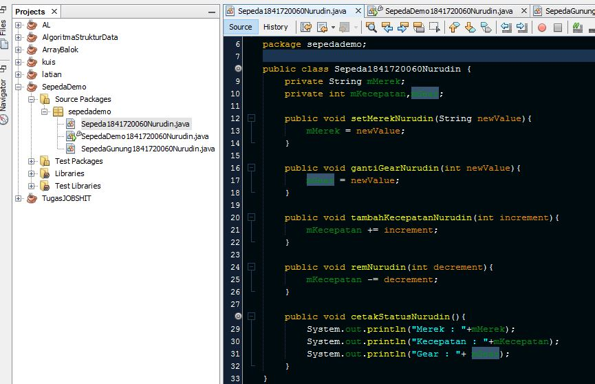
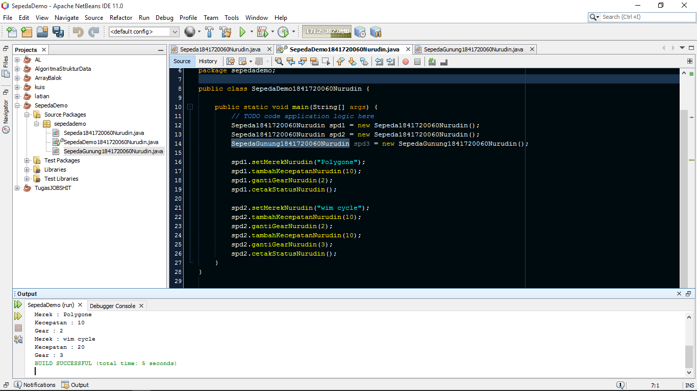
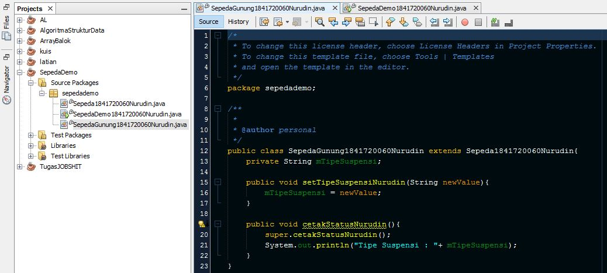
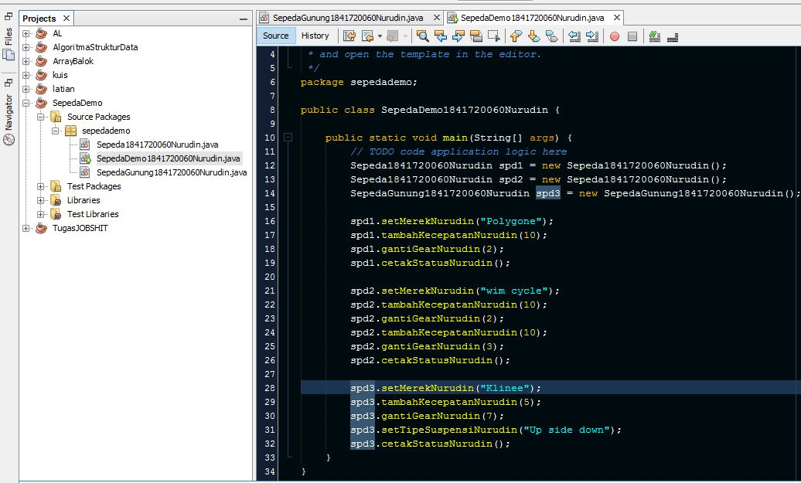
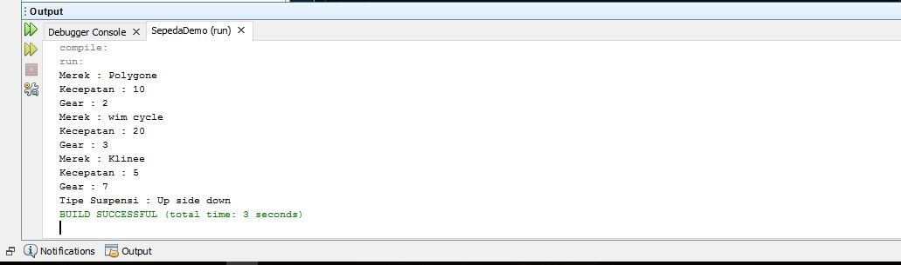
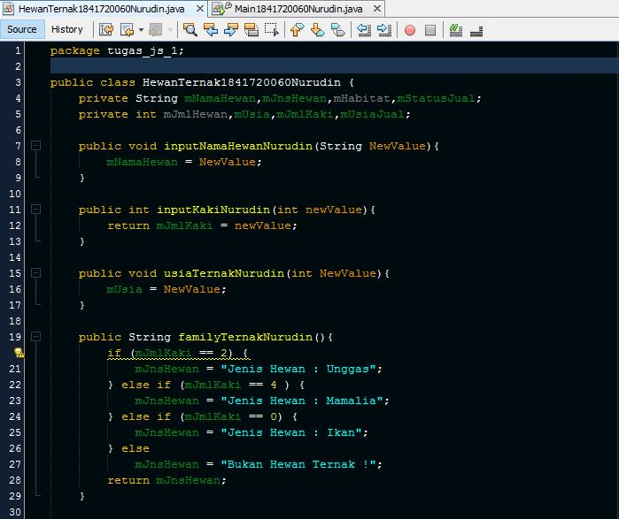
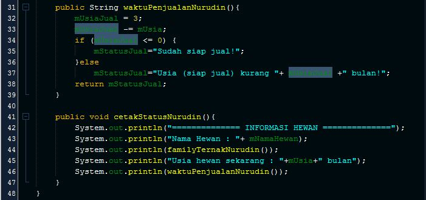
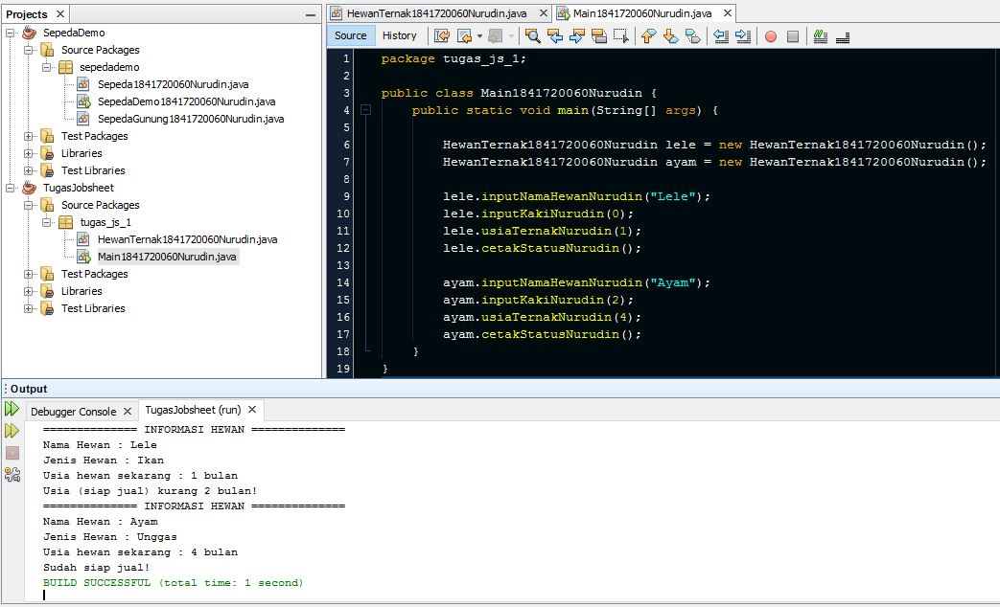

# Laporan Praktikum #1 - Pengantar Konsep PBO

## Kompetensi

1.  Perbedaan paradigma berorientasi objek dengan paradigma struktural
2.  Konsep dasar PBO

## Ringkasan Materi

Pemrograman berorientasi objek bersifat modular, dimana program dipecah menjadi objek-objek tertentu yang mengenkapsulasi atribute dan method didalamnya. Dengan demikian maka Pemrograman berorientasi objek memiliki kelebihan jika dibanding dengan pemrograman struktural. Yaitu ketika melakukan suatu perubahan pada kode program maka tidak akan mempengaruhi kode program lainnya. 

## Percobaan
### Percobaan 1

Didalam percobaan ini, akan mendemonstrasikan bagaimana membuat class, membuat object, 
kemudian mengakses method didalam class tersebut.
#### Class Sepeda

Link kode program : [kode program](../../src/1_Pengantar_Konsep_PBO/percobaan1/Sepeda1841720060Nurudin.java)
#### Class SepedaDemo (main)

Link kode program : [kode program](../../src/1_Pengantar_Konsep_PBO/percobaan1/SepedaDemo1841720060Nurudin.java)

### Percobaan 2

Didalam percobaan ini, akan didemonstrasikan salah satu fitur yang paling penting dalam PBO, yaitu 
inheritance. Disini kita akan membuat class SepedaGunung yang mana adalah turunan/warisan dari 
class Sepeda. Pada dasarnya class SepedaGunung adalah sama dengan class Sepeda, hanya saja pada 
sepeda gunung terdapat tipe suspensi. Untuk itu kita tidak perlu membuat class Sepeda Gunung dari 
nol, tapi kita wariskan saja class Sepeda ke class SepedaGunung.

#### Class SepedaGunung

Link kode program : [kode program](../../src/1_Pengantar_Konsep_PBO/percobaan2/SepedaGunung1841720060Nurudin.java)
#### Class SepedaDemo (main)

Link kode program : [kode program](../../src/1_Pengantar_Konsep_PBO/percobaan2/SepedaDemo1841720060Nurudin.java)

## Pertanyaan

1.  Sebutkan dan jelaskan aspek-aspek yang ada pada pemrograman berorientasi objek!
2.  Apa yang dimaksud dengan object dan apa bedanya dengan class?
3.  Sebutkan salah satu kelebihan utama dari pemrograman berorientasi objek dibandingkan dengan pemrograman struktural!
4.  Pada class Sepeda, terdapat state/atribut apa saja?
5.  Tambahkan atribut warna pada class Sepeda.
6.  Mengapa pada saat kita membuat class SepedaGunung, kita tidak perlu membuat class nya dari nol?

### JAWAB

1. - Objek, yaitu model yang dibuat mirip seperti di dunia nyata. Objek memiliki :
		- state (atribute) umumnya berupa suatu variabel
		- behaviour yaitu sifat dari suatu objek berupa method
	- Class adalah rancangan secara umum untuk membuat suatu objek
	- Sifat objek yaitu terdapat 4 sifat yang berlaku pada PBO :
		- Abstraksi
		- Enkapsulasi
		- Inheritance
		- Polymorphism
2. Objek adalah suatu rangkaian pada program yang memodelkan suatu benda dalam dunia nyata sedangkan class adalah suatu prototype dalam membuat objek
3. PBO bersifat modular sehingga ketika kita ingin menambah suatu fitur dengan mengupdate atau merubah potongan kode program dalam sebuah objek, class atau method. maka tidak akan berpengaruh terhadap keseluruhan kode program
4. mMerk, mKecepatan, mGear
5. private String mWarna;
6. Karena pada kelas SepedaGunung menggunakan sifat PBO yaitu inheritance atau pewarisan. dimana class ini sebagai child class dan dapat memanggil atribut serta method pada class parent-nya yaitu class Sepeda

## Tugas

Program menentukan status pada hewan ternak 

### Class HewanTernak

Link kode program : [kode program](../../src/1_Pengantar_Konsep_PBO/tugas/HewanTernak1841720060Nurudin.java)

### Class Main

Link kode program : [kode program](../../src/1_Pengantar_Konsep_PBO/tugas/Main1841720060Nurudin.java)

## Kesimpulan

Pemrograman berbasis objek merupakan bentuk model yang mengadopsi dari objek - objek yang terdapat pada kehidupan nyata. Dengan demikian pada baris programnya dapat dikelompokkan menjadi modul tertentu, sehingga kode program yang dihasilkan lebih fleksibel dan dapat memudahkan dalam maintenance program di kemudian hari.

## Pernyataan Diri

Saya menyatakan isi tugas, kode program, dan laporan praktikum ini dibuat oleh saya sendiri. Saya tidak melakukan plagiasi, kecurangan, menyalin/menggandakan milik orang lain.

Jika saya melakukan plagiasi, kecurangan, atau melanggar hak kekayaan intelektual, saya siap untuk mendapat sanksi atau hukuman sesuai peraturan perundang-undangan yang berlaku.

Ttd,

***(Mukhammad Nuruddin Ismail)***
