# Laporan Praktikum #2 - Class dan Object

## Kompetensi
- Mahasiswa dapat memahami deskripsi dari class dan object
- Mahasiswa memahami implementasi dari class
- Mahasiswa dapat memahami implementasi dari attribute
- Mahasiswa dapat memahami implementasi dari method
- Mahasiswa dapat memahami implementasi dari proses instansiasi
- Mahasiswa dapat memahami implementasi dari try-catch
- Mahasiswa dapat memahami proses pemodelan class diagram menggunakan UML

## Ringkasan Materi

Untuk membuat suatu object perlu dilakukan instansiasi objek pada main class. Dalam suatu object memilki attribute dan method dimana untuk pendeklarasian attribute mirip seperti pendeklarasian variabel.
Method dibedakan menjadi dua jenis, yaitu
1. Method tanpa nilai return ``(void)``. Method ini tidak memerlukan nilai return. Jadi ketika melakukan pemanggilan method jenis void pada main class, method akan diproses atau ditampilkan sesuai apa yang tertulis dalam Method
2. Method dengan nilai return. Method ini akan mengembalikan sebuah nilai yang sesuai dengan tipe data dari method itu sendiri. ciri dari method ini yaitu dalam pendeklarasiannya tidak bertipe void dan diakhir method identik dengan kata kunci return

Dalam modul ini juga dibahas tentang pembuatan diagram UML dan juga error handling menggunakan try catch. penggunaan try catch yaitu sebagai antisipasi agar program tidak stuck ketika mengalami error dari luar source code (inputan user).
Diagram UML menggambarkan komponen dari suatu class atau Object. Diagram ini umumnya memiliki 3 buah row tabel. baris paling atas berupa nama class, baris kedua berupa nama attribute beserta hak akses dan tipe datanya, baris terakhir berupa nama method, hak akses dan tipe data method.  

## Percobaan

### Percobaan 1 : Membuat Class Diagram
Dalam  suatu  perusahaan  salah  satu  data  yang  diolah  adalah  data  karyawan.  Setiap karyawan  memiliki id, nama, jenis kelamin, jabatan, jabatan, dan gaji. Setiap mahasiswa juga bisa menampilkan data diri pribadi dan melihat gajinya.

- Gambarkan desain class diagram dari studi kasus 1!

- 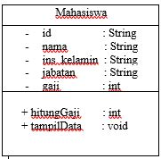

#### Pertanyaan percobaan 1
1. Sebutkan Class apa saja yang bisa dibuat dari studi kasus 1!
2. Sebutkan  atribut  beserta  tipe  datanya  yang  dapat  diidentifikasi  dari  masing-masing class dari studi kasus 1!
3. Sebutkan method-method yang sudah anda buat dari masing-masing class pada studi kasus 1!

#### Jawab :

1. Dalam studi kasus 1 membuat class karyawan
2. Pada class karyawan memliki atribut dan tipe data :
  - id : String
  - nama : String
  - jns_kelamin : String
  - jabatan : String
  - gaji : int
3. Pada class karyawan memiliki method :
  - hitungGaji() : int
  - tampilData() : void

### Percobaan 2 : Membuat dan Mengakses Anggota Class

Menulis kode program berdasar digram class.

#### Membuat class Mahasiswa
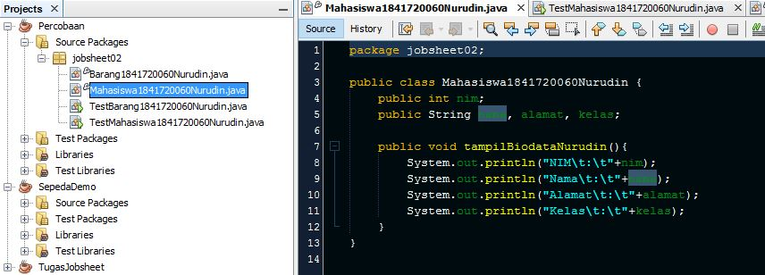

Link kode program : [Mahasiswa1841720060Nurudin.java](../../src/2_Class_dan_Object/Mahasiswa1841720060Nurudin.java)

#### Membuat class TestMahasiswa
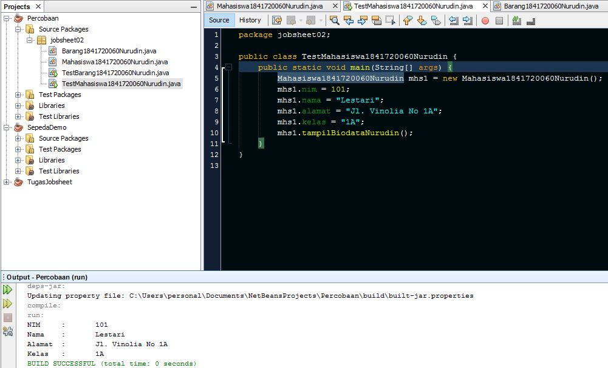

Link kode program : [TestMahasiswa1841720060Nurudin.java](../../src/2_Class_dan_Object/pertanyaan/TestMahasiswa1841720060Nurudin.java)

#### Pertanyaan percobaan 2
1. Jelaskan pada bagian mana proses pendeklarasian atribut pada program diatas!
2.  Jelaskan pada bagian mana proses pendeklarasian method pada program diatas!
3.  Berapa banyak objek yang di instansiasi pada program diatas!
4. Apakah yang sebenarnya dilakukan pada sintaks program “mhs1.nim=101” ?
5. Apakah yang sebenarnya dilakukan pada sintaks program “mhs1.tampilBiodata()” ?
6.  Instansiasi 2 objek lagi pada program diatas!

#### Jawab
1. Pada class `Mahasiswa1841720060Nurudin` baris nomor 4 dan 5
2. Pada class `Mahasiswa1841720060Nurudin` baris 7
3. 1 objek
4. memberi nilai 101 pada atribut `nim` di objek `mhs1`
5. memanggil method `tampilBiodata` yang berisi kode untuk menampilkan data
6. 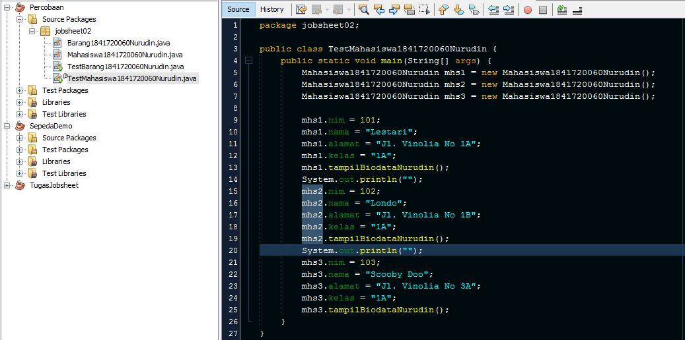
   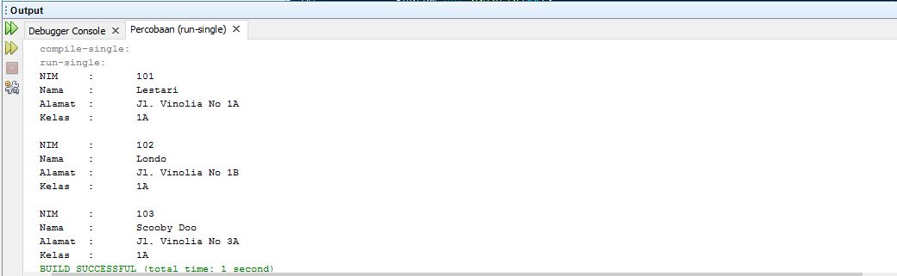
Link kode program : [TestMahasiswa1841720060Nurudin.java](../../src/2_Class_dan_Object/TestMahasiswa1841720060Nurudin.java)

### Percobaan 3 : Menulis method yang memiliki argument/parameter dan memiliki return
Pada percobaan ini menunjukkan bagaimana perilaku method yang memiliki nilai return

#### Membuat class Barang
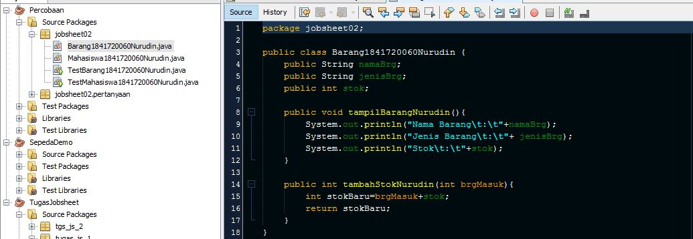

Link kode program : [Barang1841720060Nurudin.java](../../src/2_Class_dan_Object/Barang1841720060Nurudin.java)

#### Membuat class TestBarang
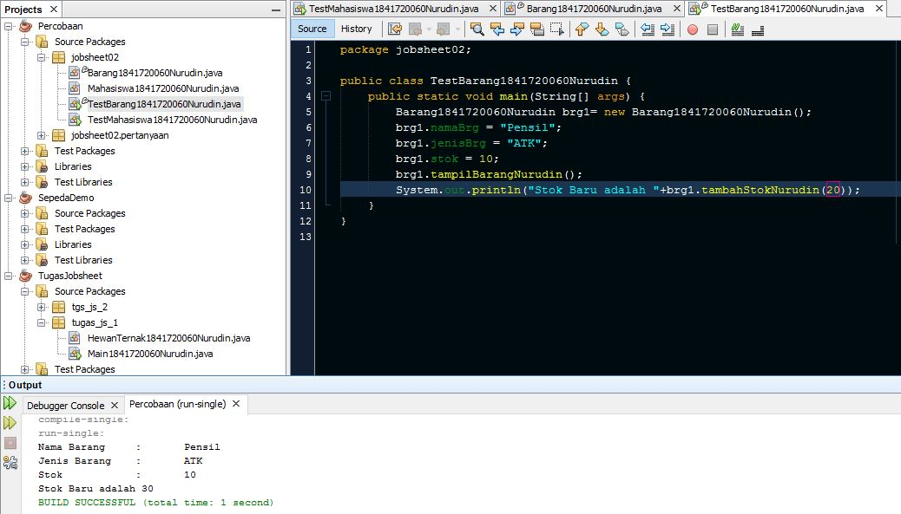

Link kode program : [TestBarang1841720060Nurudin.java](../../src/2_Class_dan_Object/TestBarang1841720060Nurudin.java)

#### Pertanyaan
1. Apakah fungsi argumen dalam suatu method?
2. Ambil kesimpulan tentang kegunaan dari kata kunci return , dan kapan suatu method harus memiliki return!

#### Jawab
1. argumen dalam pembuatan suatu method berfungsi sebagai inputan dalam method
2. return digunakan untuk mengembalikan suatu nilai dari proses yang dilakukan dalam suatu method. Suatu method harus memilki return jika memiliki tipe data selain void

## Tugas

1.   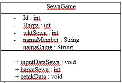

2. - Class `SewaGame1841720060Nurudin`
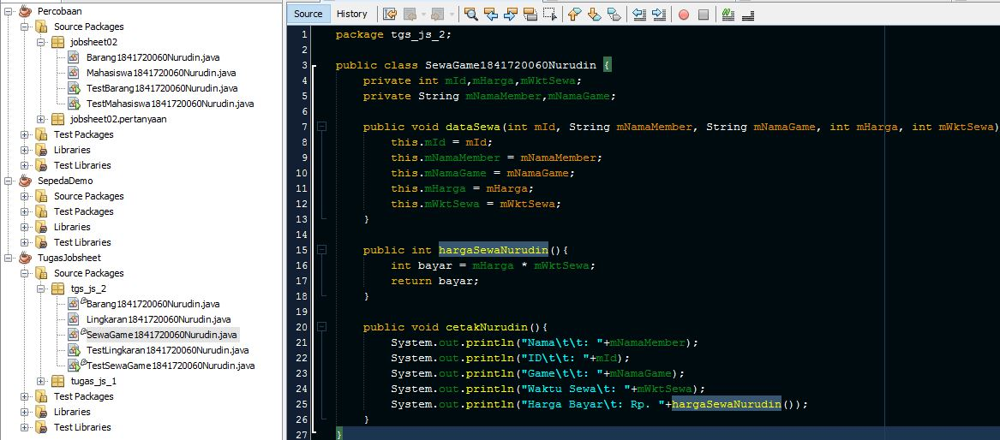
Link kode program : [SewaGame1841720060Nurudin.java](../../src/2_Class_dan_Object/tugas/SewaGame1841720060Nurudin.java)
  - Class `TestSewaGame1841720060Nurudin`
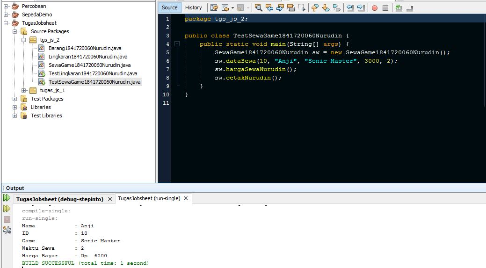
Link kode program : [TestSewaGame1841720060Nurudin.java](../../src/2_Class_dan_Object/tugas/TestSewaGame1841720060Nurudin.java)

3. - Class `Lingkaran`
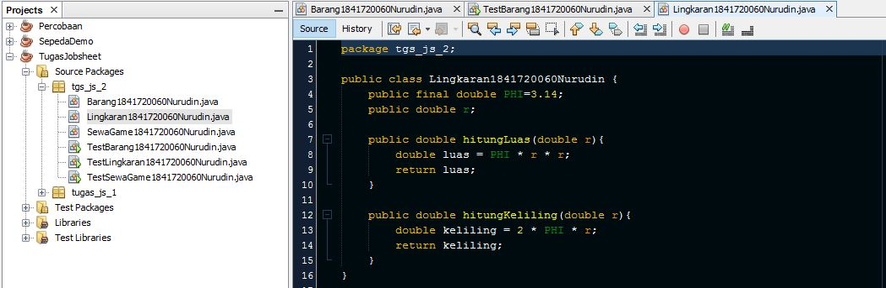
Link kode program : [Lingkaran1841720060Nurudin.java](../../src/2_Class_dan_Object/tugas/Lingkaran1841720060Nurudin.java)
  - Class `TestLingkaran`
  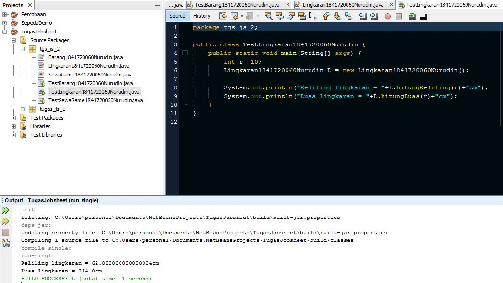
Link kode program : [TestLingkaran1841720060Nurudin.java](../../src/2_Class_dan_Object/tugas/TestSewaGame1841720060Nurudin.java)

4. - Class `Barang1841720060Nurudin`
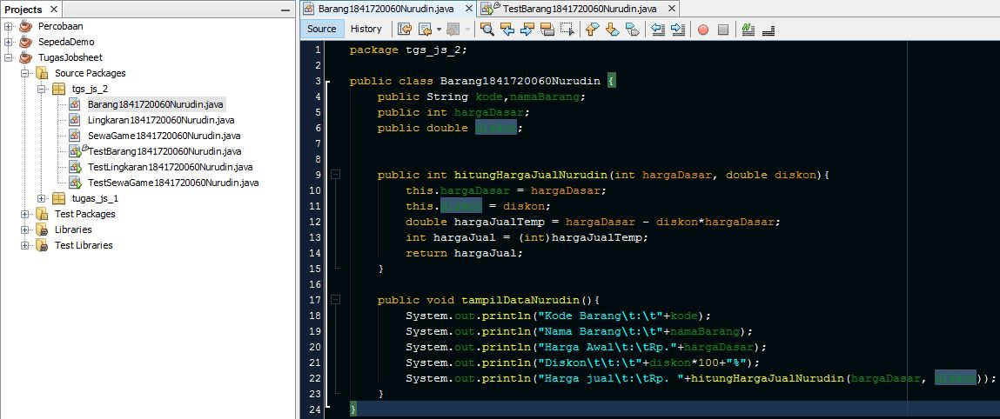
Link kode program : [Barang1841720060Nurudin.java](../../src/2_Class_dan_Object/tugas/Barang1841720060Nurudin.java)
  - Class `TestLingkaran`
  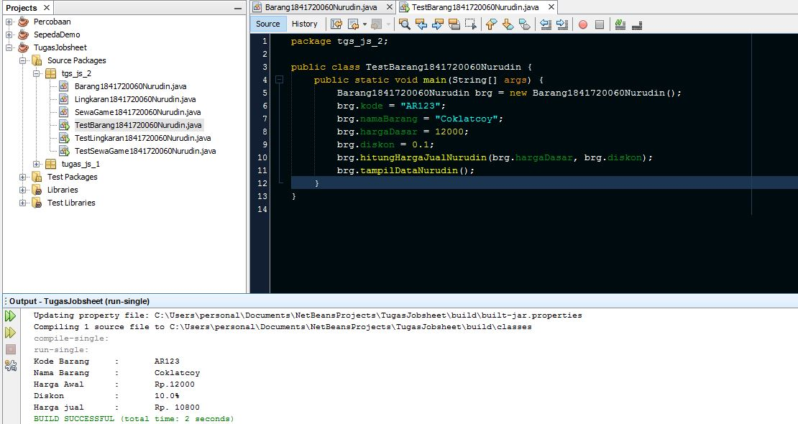
Link kode program : [TestBarang1841720060Nurudin.java](../../src/2_Class_dan_Object/tugas/TestBarang1841720060Nurudin.java)

## Kesimpulan

berdasar hasil praktikum dan percobaan yang telah saya lakukan. Dapat disimpulkan bahwa untuk menangani error yang kemungkinan terjadi dari sisi user dapat menggunakan konsep try - catch sebagai exception agar program dapat terus berjalan.Kemudian dalam pembuatan method yang memiliki tipe data harus memiliki nilai return

## Pernyataan Diri

Saya menyatakan isi tugas, kode program, dan laporan praktikum ini dibuat oleh saya sendiri. Saya tidak melakukan plagiasi, kecurangan, menyalin/menggandakan milik orang lain.

Jika saya melakukan plagiasi, kecurangan, atau melanggar hak kekayaan intelektual, saya siap untuk mendapat sanksi atau hukuman sesuai peraturan perundang-undangan yang berlaku.

Ttd,

***(Mukhammad Nuruddin Ismail)***
