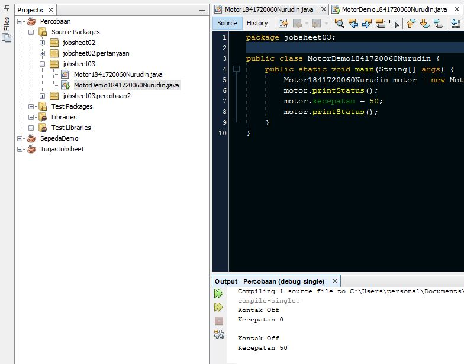

# Laporan Praktikum #3 - Enkapsulasi Pada Pemrograman Berorientasi Objek

## Kompetensi
>Setelah melakukan percobaan pada modul ini, mahasiswa memahami konsep:
1.  Konstruktor
2.  Akses Modifier
3.  Atribut/method pada class
4.  Intansiasi atribut/method
5.  Setter dan getter
6.  Memahami notasi pada UML Class Diagram

## Ringkasan Materi
Enkapsulasi yaitu suatu konsep dalam PBO yang disebut juga _information-hiding_ dimana terjadi pembungkusan method dan atribut dalam suatu class atau objek.

Dalam pembuatan atribut atau method terdapat akses modifier yang berfungsi untuk mengatur pada bagian mana saja suatu atribut dan method dapat diakses. Terdapat pula suatu method khusus yang bernama konstruktor.
Konstruktor  mirip  dengan  method  cara  deklarasinya  akan  tetapi  tidak  memiliki  tipe  return.  Dan konstruktor  dieksekusi ketika instan dari objek dibuat. Jadi setiap kali sebuat objek dibuat dengan
keyword new() maka konstruktor akan dieksekusi.

Untuk menjaga suatu atribut agar tidak diberi suatu nilai yang kemungkinan tidak sesuai oleh user, maka dapat menggunakan metode setter dan getter.


## Percobaan

### Percobaan 1 : Enkapsulasi
>Didalam percobaan enkapsulasi, membuat class Motor yang memiliki atribut kecepatan dan kontakOn,
dan memiliki method printStatus() untuk menampilkan status motor.

- Class Motor
 
- Class MotorDemo
 

 `Link source code pada kedua class tersebut tidak disertakan, karena pada percobaan 2 dilakukan perubahan code terhadap kedua class`

### Percobaan 2 : Access Modifier

>Pada percobaan ini akan digunakan access modifier untuk memperbaiki cara kerja class Motor pada percobaan ke-1.

- Class Motor
 
Link kode program : [Motor1841720060Nurudin.java](../../src/3_Enkapsulasi/percobaan/motorenkapsulai/Motor1841720060Nurudin.java)

- Class MotorDemo

Link kode program : [MotorDemo1841720060Nurudin.java](../../src/3_Enkapsulasi/percobaan/motorenkapsulai/MotorDemo1841720060Nurudin.java)

### Percobaan 3 : Getter dan Setter
>Misalkan  di  sebuah  sistem  informasi  koperasi,  terdapat  class  Anggota.  Anggota  memiliki  atribut nama, alamat  dan  simpanan, dan method setter, getter  dan setor dan pinjam.  Semua atribut pada anggota  tidak  boleh  diubah  sembarangan,  melainkan  hanya  dapat  diubah  melalui  method  setter, getter, setor dan tarik.  Khusus untuk atribut simpanan tidak terdapat setter karena simpanan akan bertambah  ketika  melakukan  transaksi  setor  dan  akan  berkurang  ketika  melakukan peminjaman/tarik.

- Class Anggota1841720060Nurudin


- Class KoperasiDemo1841720060Nurudin

`Link source code pada kedua class tersebut tidak disertakan, karena pada percobaan 4 dilakukan perubahan code terhadap kedua class`

### Percobaan 4 : Konstruktor, Instansiasi
>Pada percobaan ini dilakukan pembuatan konstruktor untuk inisialisasi nilai atribut objek

- Class KoperasiDemo1841720060Nurudin.java
>Pada bagian ini class KoperasiDemo1841720060Nurudin tidak meggunakan konstruktor


- Class Anggota1841720060Nurudin

Link kode program : [Anggota1841720060Nurudin.java](../../src/3_Enkapsulasi/percobaan/koperasigettersetter/Anggota1841720060Nurudin.java)

- Class KoperasiDemo1841720060Nurudin

Link kode program : [KoperasiDemo1841720060Nurudin.java](../../src/3_Enkapsulasi/percobaan/koperasigettersetter/KoperasiDemo1841720060Nurudin.java)

## Pernyataan
1.  Apa yang dimaksud getter dan setter?
2.  Apa kegunaan dari method getSimpanan()?
3.  Method apa yang digunakan untk menambah saldo?
4.  Apa yand dimaksud konstruktor?
5.  Sebutkan aturan dalam membuat konstruktor?
6.  Apakah boleh konstruktor bertipe private?
7.  Kapan menggunakan parameter dengan passsing parameter?
8.  Apa perbedaan atribut class dan instansiasi atribut?
9.  Apa perbedaan class method dan instansiasi method?

### Jawab
1. Getter adalah public method dan memiliki tipe data return, yang berfungsi untuk mendapatkan nilai dari  atribut  private.  Sedangkan  setter  adalah  public  method  yang  tidak  memliki  tipe  data  return, yang berfungsi untuk memanipulasi nilai dari atribut private.
2. Untuk memanggil nilai pada atribut yang di return dalam method getSimpanan()
3. Method setor()
4. Konstruktor adalah method khusus yang tidak memiliki tipe data dan void, access modifier tertentu, dan nilai return. konstruktor harus bernama persis sama dengan nama Class. Konstruktor akan dieksekusi ketika melakukan instansiasi objek.
5. - Konstruktor harus bernama sama dengan nama Class
   - Konstruktor tidak memiliki tipe data return
   - Konstruktor tidak menggunakan access modifier abstract, static, final , synchronized
6. Tidak boleh
7. Ketika atribut membutuhkan nilai yang spesifik, maka lebih baik menggunakan passing parameter dengan cara memanggil atribut pada parameter konstruktor.
8. Atribut class adalah atribut yang dibuat dalam suatu class. sedangkan instansiasi atribut adalah pemanggilan atribut pada class yang berbeda melalui suatu objek
9. Class method adalah method yang dibuat dalam suatu class. sedangkan instansiasi method adalah pemanggilan method pada class yang berbeda melalui suatu objek  

## Tugas
1. - Class EncapDemo

Link kode program : [EncapDemo1841720060Nurudin.java](../../src/3_Enkapsulasi/tugas/EncapDemo1841720060Nurudin.java)
   - Class EncapTest

Link kode program : [EncapTest1841720060Nurudin.java](../../src/3_Enkapsulasi/tugas/EncapTest1841720060Nurudin.java)
2. pada class EncapTest nilai age tetap 30 meski diset 35 karena pada method setAgeNnurudin di class tersebut. Dilakukan pengkondisian dimana nilai maksimum untuk atribut age adalah 30
3. untuk memberi nilai maksimum 30 dan minimum 18 pada atribut age dapat mengubah code dalam method setAgeNnurudin menjadi
```java
public void setAgeNurudin(int newAge){
        if (newAge>30) {
            mAge = 30;
        }else if (mAge<18) {
            mAge = 18;
        }else{
         mAge = newAge;   
        }
    }
```


4. - Class Anggota1841720060Nurudin

Link kode program : [KoperasiDemo1841720060Nurudin.java](../../src/3_Enkapsulasi/tugas/koperasi/Anggota1841720060Nurudin.java)
   - Class EncapTest

Link kode program : [Anggota1841720060Nurudin.java](../../src/3_Enkapsulasi/tugas/koperasi/TestKoperasi1841720060Nurudin.java)

5. - Class Anggota1841720060Nurudin

Link kode program : [Anggota1841720060Nurudin.java](../../src/3_Enkapsulasi/tugas/koperasi/koperasi_angsur10prsn/Anggota1841720060Nurudin.java)
   - Class TestKoperasi1841720060Nurudin

Link kode program : [TestKoperasi1841720060Nurudin.java](../../src/3_Enkapsulasi/tugas/koperasi/koperasi_angsur10prsn/TestKoperasi1841720060Nurudin.java)

6. - Class TestKoperasi1841720060Nurudin

Link kode program : [TestKoperasi1841720060Nurudin.java](../../src/3_Enkapsulasi/tugas/koperasi/input_console/TestKoperasi1841720060Nurudin.java)

## Kesimpulan

berdasar hasil praktikum dan percobaan yang telah saya lakukan. Dapat disimpulkan bahwa penggunaan passing parameter yaitu dengan menggunakan konstruktor lebih efisien ketika membuat objek dibanding tanpa menggunakan konstruktor. Kemudian untuk keamanan dan keefisienan kode program, perlu diperhatikan penggunaan akses modifier ketika melakukan pembuatan method dan atribut.

## Pernyataan Diri

Saya menyatakan isi tugas, kode program, dan laporan praktikum ini dibuat oleh saya sendiri. Saya tidak melakukan plagiasi, kecurangan, menyalin/menggandakan milik orang lain.

Jika saya melakukan plagiasi, kecurangan, atau melanggar hak kekayaan intelektual, saya siap untuk mendapat sanksi atau hukuman sesuai peraturan perundang-undangan yang berlaku.

Ttd,

***(Mukhammad Nuruddin Ismail)***
