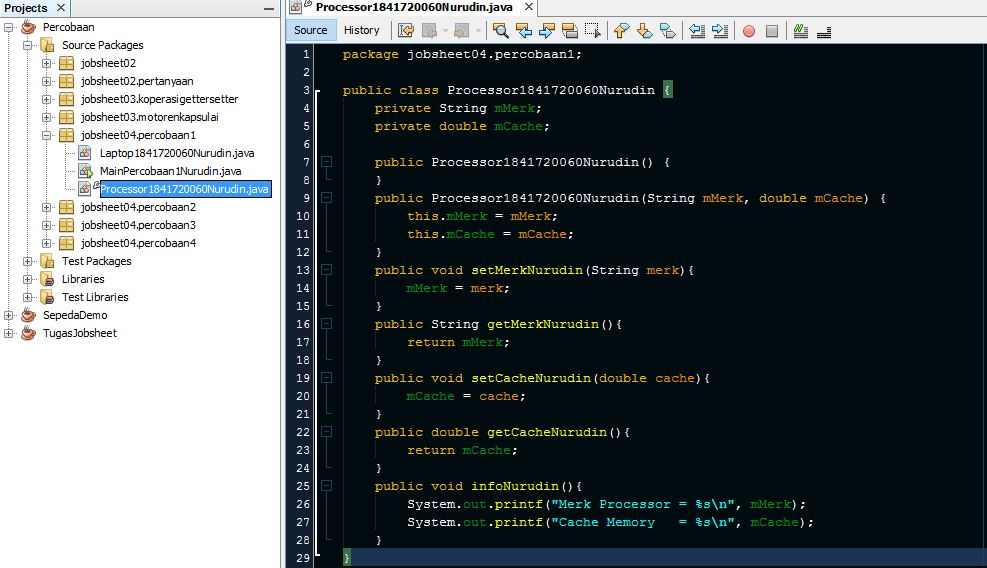
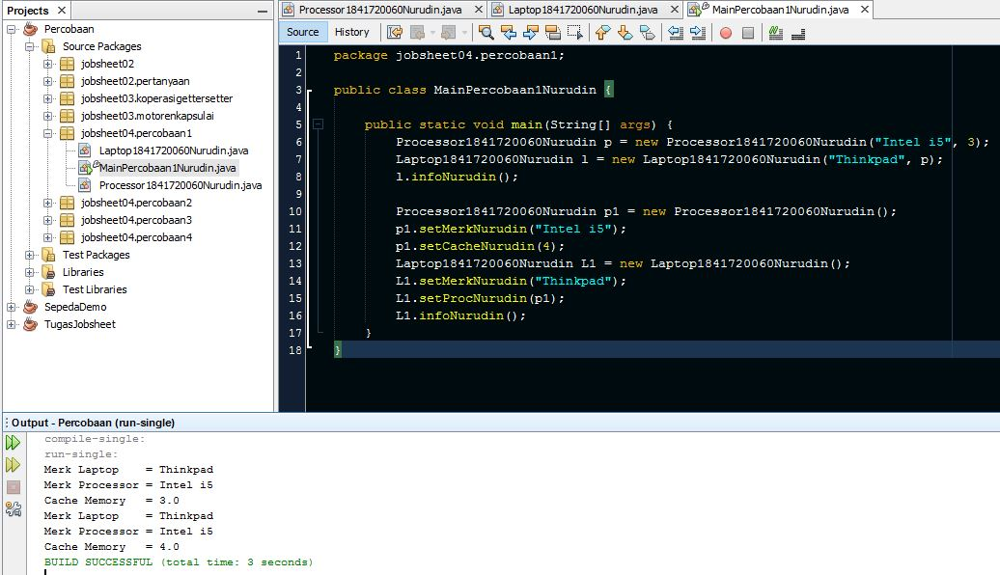
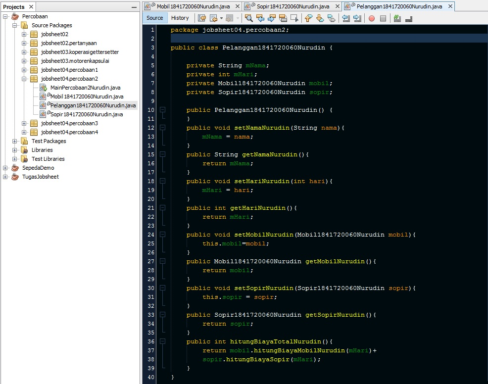
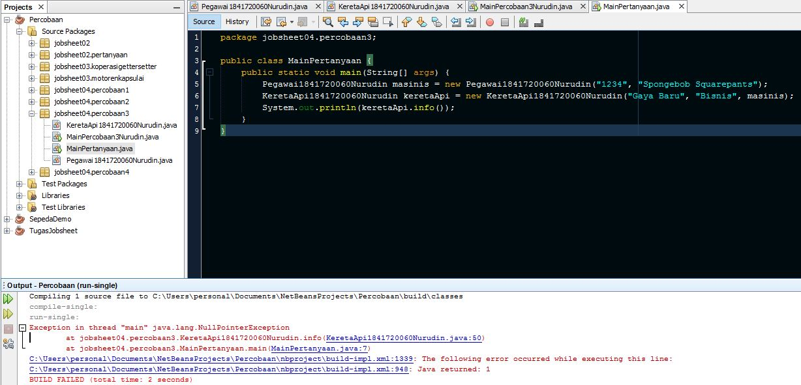

# Laporan Praktikum #4 - Relasi Kelas

## Kompetensi
Setelah menempuh pokok bahasan ini, mahasiswa mampu:
1.  Memahami konsep relasi kelas;
2.  Mengimplementasikan relasi has‑a dalam program

## Ringkasan Materi

Pada  kasus yang lebih kompleks, dalam suatu sistem akan ditemukan lebih dari satu  class yang saling memiliki keterkaitan antara  class  satu dengan yang lain. keterkaitan ini disebut relasi antar kelas. Terdapat 3 Jenis  relasi dalam konsep PBO yaitu agregasi  (has-a), dependensi (uses-a) dan inheritance (is-a).

## Percobaan

### Percobaan 1
Membuat relasi dimana class `Laptop1841720060Nurudin` *has a* class `Processor1841720060Nurudin`
- Membuat Processor1841720060Nurudin.java
  
  Link kode program : [Processor1841720060Nurudin.java](../../src\4_Relasi_Class\percobaan\percobaan1\Processor1841720060Nurudin.java)

- Membuat Laptop1841720060Nurudin.java
    
    Link kode program : [Laptop1841720060Nurudin.java](../../src\4_Relasi_Class\percobaan\percobaan1\Laptop1841720060Nurudin.java)

- Membuat MainPercobaan1Nurudin.java
  
  Link kode program : [MainPercobaan1Nurudin.java](../../src\4_Relasi_Class\percobaan\percobaan1\MainPercobaan1Nurudin.java)

#### Pertanyaan percobaan 1
1.  Di dalam  class  Processor  dan  class  Laptop  , terdapat method  setter  dan  getter  untuk masing‑masing atributnya. Apakah gunanya method setter dan getter tersebut ?
2.  Di  dalam  class  Processor  dan  class  Laptop,  masing‑masing  terdapat  konstruktor default  dan konstruktor  berparameter.  Bagaimanakah  beda  penggunaan  dari  kedua  jenis konstruktor tersebut ?
3.  Perhatikan  class  Laptop,  di  antara  2  atribut yang  dimiliki  (merk  dan  proc),  atribut manakah yang bertipe object ?
4.  Perhatikan  class  Laptop,  pada  baris  manakah  yang  menunjukan  bahwa  class  Laptop memiliki relasi dengan class Processor ?
5.  Perhatikan pada class Laptop , Apakah guna dari sintaks proc.info() ?
6.  Pada class MainPercobaan1Nurudin, terdapat baris kode:
```java
Laptop l = new Laptop("Thinkpad", p);
```
Apakah p tersebut ?
Dan apakah yang terjadi jika baris kode tersebut diubah menjadi:
```java
Laptop  l  =  new  Laptop("Thinkpad",  new  Processor1841720060Nurudin("Intel  i5", 3));
```
Bagaimanakah hasil program saat dijalankan, apakah ada perubahan ?

#### Jawab :

1. Setter dan Getter digunakan untuk mengakses secara tidak langsung atribut atau variabel yang memiliki akses modifier private
2. Jika melakukan instansiasi konstruktor default, untuk mengakses atribut-atributnya harus memanggil satu-persatu. Sedangkan untuk konstruktor berparameter tidak perlu memanggil lagi atribut-atribut objek yang telah menjadi parameter dalam konstruktor.
3. proc
4. Pada baris 6,10,20,21. (Baris yang terdapat nama class Processor1841720060Nurudin)
5. Memanggil method infoNurudin pada class Processor1841720060Nurudin
6. `p` adalah nama objek pada class Processor1841720060Nurudin. Jika `p` diubah menjadi `new  Laptop("Thinkpad",  new  Processor1841720060Nurudin("Intel  i5", 3)` sama saja tidak terjadi perubahan, karena nilai parameter yang ditulis sama seperti parameter pada instansiasi objek p.

### Percobaan 2

Perhatikan diagram class berikut yang menggambarkan sistem rental mobil. Pelanggan  bisa menyewa mobil sekaligus sopir. Biaya sopir dan biaya sewa mobil dihitung per hari.


-  Membuat class `Mobil1841720060Nurudin`

Link kode program : [Laptop1841720060Nurudin.java](../../src\4_Relasi_Class\percobaan\percobaan2\Mobil1841720060Nurudin.java)

-  Membuat class `Sopir1841720060Nurudin`

Link kode program : [Sopir1841720060Nurudin.java](../../src\4_Relasi_Class\percobaan\percobaan2\Sopir1841720060Nurudin.java)

-  Membuat class `Pelanggan1841720060Nurudin`

Link kode program : [Pelanggan1841720060Nurudin.java](../../src\4_Relasi_Class\percobaan\percobaan2\Pelanggan1841720060Nurudin.java)

-  Membuat class `MainPercobaan2Nurudin`

Link kode program : [MainPercobaan2Nurudin.java](../../src\4_Relasi_Class\percobaan\percobaan2\MainPercobaan2Nurudin.java)

#### Pertanyaan percobaan 2
1. Perhatikan class  Pelanggan. Pada baris program manakah  yang menunjukan bahwa class Pelanggan memiliki relasi dengan class `Mobil1841720060Nurudin` dan class `Sopir1841720060Nurudin` ?
2. Perhatikan  method  `hitungBiayaSopirNurudin`  pada  class  `Sopir1841720060Nurudin`, serta  method `hitungBiayaMobilNurudin`  pada  class  `Mobil1841720060Nurudin`.  Mengapa  menurut  Anda  method  tersebut  harus memiliki argument hari ?
3. Perhatikan  kode  dari  class  `Pelanggan1841720060Nurudin`  Untuk  apakah  perintah `mobil.hitungBiayaMobilNurudin(hari)` dan `sopir.hitungBiayaSopirNurudin(hari)` ?
4. Perhatikan  class  MainPercobaan2Nurudin.  Untuk  apakah  sintaks  `p.setMobilNurudin(m)` dan `p.setSopirNurudin(s)` ?
5. Perhatikan  class  MainPercobaan2Nurudin.  Untuk  apakah  proses  `p.hitungBiayaTotalNurudin()` tersebut ?
6. Perhatikan  class  `MainPercobaan2Nurudin`,  coba  tambahkan  pada  baris  terakhir  dari  method main dan amati perubahan saat di‑run! `System.out.println(p.getMobilNurudin().getMerkNurudin());` Jadi untuk apakah sintaks `p.getMobilNurudin().getMerkNurudin()` yang ada di dalam method main tersebut?

#### Jawab
1. Pada baris program pembuatan atribut/variabel mobil dan sopir, dan method setter getter dari atribut tsb.
2. Karena harga ditentukan oleh seberapa lama menyewa mobil dan sopir. Dalam hal ini, waktu menggunakan satuan hari
3. Memanggil method untuk menghitung biaya milik class Mobil1841720060Nurudin dan Sopir1841720060Nurudin
4. `p.setMobilNurudin(m)` digunakan untuk memasukkan nilai atribut pada objek p ke dalam method setMobilNurudin. dan `p.setSopirNurudin(s)` memasukkan nilai atribut objek p ke dalam method setSopirNurudin
5. Mengkalkulasi total biaya sewa mobil dan sopir

6. Ketika menambahkan code
  ```java
  System.out.println(p.getMobilNurudin().getMerkNurudin());
  ```
  Pada akhir main, akan menampilkan nilai atribut merk dari class Mobil1841720060Nurudin. Maka `p.getMobilNurudin().getMerkNurudin()` berfungsi untuk memanggil method getMerkNurudin pada class Mobil1841720060Nurudin melalui method getMobilNurudin yang terdapat pada class Pelanggan1841720060Nurudin
  

### Percobaan 3
Pada percobaan‑percobaan sebelumnya, relasi dalam class dinyatakan dalam one‑to‑one. Tetapi ada kalanya  relasi  class  melibatkan  lebih  dari  satu.  Hal  ini  disebut  dengan  multiplicity.

- Membuat class Pegawai1841720060Nurudin

Link kode program : [Pegawai1841720060Nurudin.java](../../src\4_Relasi_Class\percobaan\percobaan3\Pegawai1841720060Nurudin.java)

- Membuat class KeretaApi1841720060Nurudin

Link kode program : [KeretaApi1841720060Nurudin.java](../../src\4_Relasi_Class\percobaan\percobaan3\KeretaApi1841720060Nurudin.java)

- Membuat class MainPercobaan3Nurudin

Link kode program : [MainPercobaan3Nurudin.java](../../src\4_Relasi_Class\percobaan\percobaan3\MainPercobaan3Nurudin.java)

#### Pertanyaan
1.  Di dalam  method  info()  pada  class  KeretaApi, baris  this.masinis.info()  dan this.asisten.info() digunakan untuk apa ?
2.  Buatlah  main  program  baru  dengan  nama  class  MainPertanyaan  pada  package  yang
sama. Tambahkan kode berikut pada method main() !
```java
Pegawai masinis = new Pegawai("1234", "Spongebob Squarepants");
KeretaApi keretaApi = new KeretaApi("Gaya Baru", "Bisnis", masinis);
System.out.println(keretaApi.info());
```
3.  Apa hasil output dari main program tersebut ? Mengapa hal tersebut dapat terjadi ?
4.  Perbaiki class KeretaApi sehingga program dapat berjalan !

#### Jawab
1. Digunakan untuk menampilkan method infoNurudin() dari objek masinis dan pegawai
2. 
3. Muncul Pesan error. Karena pada method infoNurudin() yang terdapat di dalam class KeretaApi1841720060Nurudin memerlukan 2 objek dari class Pegawai1841720060Nurudin
4. Menambahkan method infoMasinisNurudin() pada class KeretaApi1841720060Nurudin.
```java
public String infoMasinisNurudin() {
        String info = "";
        info += "Nama : " + this.mNama + "\n";
        info += "Kelas : " + this.mKelas + "\n";
        info += "========Masinis========" + this.masinis.infoNurudin() + "\n";
        return info;
    }
```
>Class MainPertanyaan
 
 Link kode program : [MainPertanyaan.java](../../src\4_Relasi_Class\percobaan\percobaan3\MainPertanyaan.java)

### Percobaan 4

 - Membuat class Penumpang1841720060Nurudin
 
 Link kode program : [Penumpang1841720060Nurudin.java](../../src\4_Relasi_Class\percobaan\percobaan4\Penumpang1841720060Nurudin.java)

 - Membuat class Kursi1841720060Nurudin
 
 Link kode program : [Kursi1841720060Nurudin.java](../../src\4_Relasi_Class\percobaan\percobaan4\Kursi1841720060Nurudin.java)

 - Membuat class Gerbong1841720060Nurudin
 
 Link kode program : [Gerbong1841720060Nurudin.java](../../src\4_Relasi_Class\percobaan\percobaan4\Gerbong1841720060Nurudin.java)

 - Membuat class MainPercobaan4Nurudin
 
 Link kode program : [MainPercobaan4Nurudin.java](../../src\4_Relasi_Class\percobaan\percobaan4\MainPercobaan4Nurudin.java)

#### Pertanyaan
 1.  Pada  main  program  dalam  class  MainPercobaan4,  berapakah  jumlah  kursi  dalam Gerbong A ?
 2.  Perhatikan potongan  kode  pada  method  info()  dalam  class  Kursi.  Apa  maksud  kode tersebut ?
 ```java
 if (this.penumpang != null) {
    info += "Penumpang: " + penumpang.infoNurudin() + "\n";
 }
 ```
 3.  Mengapa pada  method  setPenumpang()  dalam  class  Gerbong, nilai nomor dikurangi dengan angka 1 ?
 4.  Instansiasi  objek  baru  budi  dengan  tipe  Penumpang,  kemudian  masukkan  objek  baru tersebut  pada  gerbong  dengan  gerbong.setPenumpang(budi,  1).  Apakah  yang terjadi ?
 5.  Modifikasi program sehingga  tidak diperkenankan untuk menduduki kursi yang sudah ada penumpang lain !

#### Jawab
  1. 10 Kursi
  2. Jika object penumpang pada class Kursi1841720060Nurudin memiliki suatu nilai, maka tambahkan nilai method infoNurudin milik class Penumpang1841720060Nurudin ke dalam method info class Kursi1841720060Nurudin
  3. Karena nomor digunakan untuk memberikan nilai indeks pada array, dimana indeks awal array pada java dimulai dari angka 0.
  4. Source Code :
 ```java
package jobsheet04.percobaan4;
  public class MainPercobaan4Nurudin {
      public static void main(String[] args) {
        Penumpang1841720060Nurudin p = new Penumpang1841720060Nurudin("12345", "Mr.Krab");
        Penumpang1841720060Nurudin budi = new Penumpang1841720060Nurudin("67890", "Budi");
        Gerbong1841720060Nurudin gerbong = new Gerbong1841720060Nurudin("A", 10);
        gerbong.setPenumpangNurudin(p, 2);
        gerbong.setPenumpangNurudin(budi, 1);
        System.out.println(gerbong.infoNurudin());
      }
}
```
Output :

    

    >Penjelasan : Objek budi diset pada parameter method setPenumpangNurudin bersama dengan nilai 1 sehingga nilai dari objek budi ditempatkan pada kursi nomor 1      

5. Agar kursi yang sudah diisi penumpang tidak dapat diisi penumpang lain maka dilakukan modifikasi pada method setPenumpangNurudin di class Gerbong1841720060Nurudin menjadi
```java
public void setPenumpangNurudin(Penumpang1841720060Nurudin penumpang, int nomer) {
    if (this.arrayKursi[nomer-1].getPenumpangNurudin() == null) {
        this.arrayKursi[nomer-1].setPenumpangNurudin(penumpang);
    }else{
        System.out.println("sorry kursi "+nomer+" tidak kosong. Silahkan pilih kursi lain\n");
    }
}
```
sehingga menghasilkan Output :

  

## Tugas

Buatlah sebuah studi kasus, rancang dengan  class  diagram, kemudian implementasikan ke dalam program! Studi kasus harus mewakili relasi  class  dari percobaan‑percobaan  yang telah dilakukan pada materi ini, setidaknya melibatkan minimal 4 class (class yang berisi main tidak dihitung).


### Jawab
>Studi Kasus : Program untuk melihat informasi pada kereta api,meliputi informasi tentang masinis,info gerbong,info penumpang, info tempat duduk dalam gerbong, serta informasi tentang kereta api secara umum. Program juga dapat  menginputkan dan menentukan nomor kursi penumpang.

Diagram UML


### Source Code

- Membuat class KeretaApi1841720060Nurudin

Link kode program : [KeretaApi1841720060Nurudin.java](../../src\4_Relasi_Class\tugas\KeretaApi1841720060Nurudin.java)

- Membuat class Pegawai1841720060Nurudin

Link kode program : [Pegawai1841720060Nurudin.java](../../src\4_Relasi_Class\tugas\Pegawai1841720060Nurudin.java)

- Membuat class Penumpang1841720060Nurudin

Link kode program : [Penumpang1841720060Nurudin.java](../../src\4_Relasi_Class\tugas\Penumpang1841720060Nurudin.java)

- Membuat class Kursi1841720060Nurudin

Link kode program : [Kursi1841720060Nurudin.java](../../src\4_Relasi_Class\tugas\Kursi1841720060Nurudin.java)

- Membuat class Gerbong1841720060Nurudin

Link kode program : [Gerbong1841720060Nurudin.java](../../src\4_Relasi_Class\tugas\Gerbong1841720060Nurudin.java)

- Membuat class Main

Link kode program : [Main.java](../../src\4_Relasi_Class\tugas\Main.java)

#### Output Program
1. Input Penumpang

      

2. Menampilkan info Masinis  

  

3. Menampilkan info kursi Gerbong

  

4. Menampilkan info kereta api

  

5. Keluar

    

## Kesimpulan

berdasar hasil praktikum dan percobaan yang telah saya lakukan. Dalam PBO dalam suatu project setiap class yang terpisah dapat saling berelasi. Baik relas secara *one to one* atau *multiplicity* dimana sebuah class memiliki banyak relasi sekaligus.

## Pernyataan Diri

Saya menyatakan isi tugas, kode program, dan laporan praktikum ini dibuat oleh saya sendiri. Saya tidak melakukan plagiasi, kecurangan, menyalin/menggandakan milik orang lain.

Jika saya melakukan plagiasi, kecurangan, atau melanggar hak kekayaan intelektual, saya siap untuk mendapat sanksi atau hukuman sesuai peraturan perundang-undangan yang berlaku.

Ttd,

***(Mukhammad Nuruddin Ismail)***
