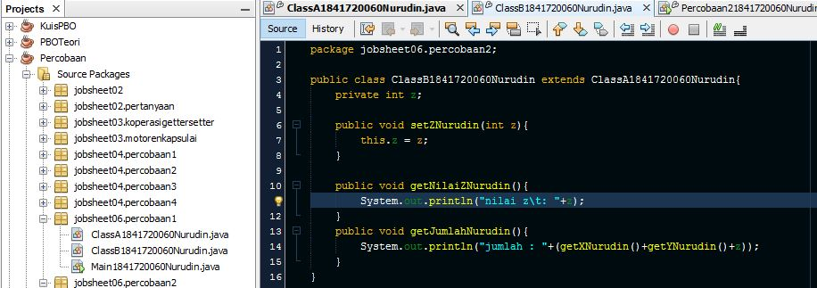
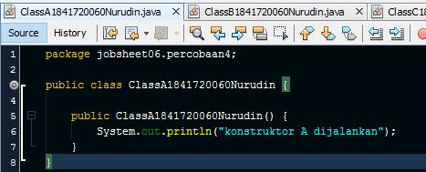
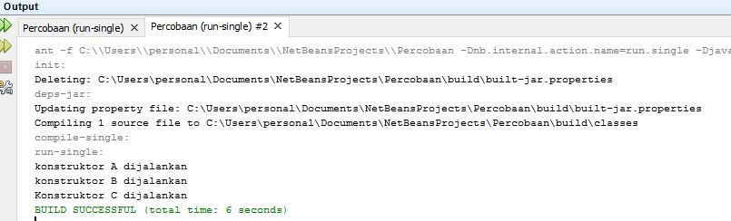
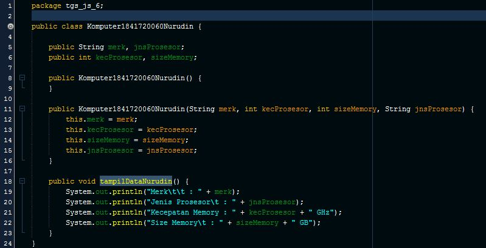

# Laporan Praktikum #6 - Inheritance (Pewarisan)

## Kompetensi

1. Memahami konsep dasar inheritance atau pewarisan.
2. Mampu membuat suatu subclass dari suatu superclass tertentu.
3. Mampu mengimplementasikan konsep single dan multilevel inheritance.
4. Mampu membuat objek dari suatu subclass dan melakukan pengaksesan terhadap atribut dan	method baik yang dimiliki sendiri atau turunan dari superclass-nya.

## Ringkasan Materi

 **Inheritance** merupakan suatu cara untuk menurunkan suatu class yang lebih umum menjadi suatu class yang lebih spesifik. Inheritance adalah salah satu ciri utama suatu bahasa program yang berorientasi pada objek. Inti dari pewarisan adalah sifat reusable dari konsep object oriented. Setiap **subclass** akan “mewarisi” sifat dari **superclass** selama bersifat protected ataupun public.

 Dalam inheritance terdapat dua istilah yang sering digunakan. Kelas yang menurunkan disebut kelas dasar (**base class/super class**), sedangkan kelas yang diturunkan disebut kelas turunan (**derived class/sub class/child class**) . Di dalam Java untuk mendeklarasikan suatu class sebagai subclass dilakukan dengan cara menambahkan kata kunci **extends** setelah deklarasi nama class, kemudian diikuti dengan nama parent class-nya. Kata kunci extends tersebut memberitahu kompiler Java bahwa kita ingin melakukan perluasan class. Berikut adalah contoh deklarasi inheritance. 

```java
public class B extends A {
     ...
}
```

Contoh diatas memberikan kompiler Java bahwa kita ingin meng-extend class A ke class B. Dengan kata lain, class B adalah subclass (class turunan) dari class A,sedangkan class A adalah parent class dari class B.


## Percobaan

### Percobaan 1 (extends)

Didalam percobaan ini, kita akan membuat class A, B, dan Percobaan 1 (sebagai class Main-nya) dengan menggunakan metode extends.


Link kode program :[ClassA1841720060Nurudin](../../src/6_Inheritance/percobaan/percobaan1/ClassA1841720060Nurudin.java)


Link kode program :[ClassB1841720060Nurudin](../../src/6_Inheritance/percobaan/percobaan1/ClassB1841720060Nurudin.java)


Link kode program :[Main1841720060Nurudin](../../src/6_Inheritance/percobaan/percobaan1/Main1841720060Nurudin.java)

#### Pertanyaan - Percobaan 1

1. Pada percobaan 1	diatas program yang	dijalankan	terjadi error, kemudian perbaiki sehingga program	tersebut bisa dijalankan dan tidak error!

2. Jelaskan apa penyebab	program pada percobaan 1 ketika dijalankan terdapat error!

**Jawab:**

1. Kesalahan terletak pada `ClassB1841720060Nurudin` Syntax yang benar adalah :

     
     
     Link kode program :[ClassB1841720060Nurudin](../../src/6_Inheritance/percobaan/ClassB1841720060Nurudin.java)

2. Error terjadi karena ClassB1841720060Nurudin tidak melakukan extends terhadap class ClassA1841720060Nurudin


### Percobaan 2 (Hak Akses)

Didalam percobaan ini, kita akan membuat class A, B, dan Percobaan 2 (sebagai class Main-nya) dengan menggunakan hak akses.


Link kode program :[ClassA1841720060Nurudin](../../src/6_Inheritance/percobaan/percobaan2/ClassA1841720060Nurudin.java)



Link kode program :[ClassB1841720060Nurudin](../../src/6_Inheritance/percobaan/percobaan2/ClassB1841720060Nurudin.java)


Link kode program :[Main1841720060Nurudin](../../src/6_Inheritance/percobaan/percobaan2/Main1841720060Nurudin.java)

#### Pertanyaan - Percobaan 2

1. Pada percobaan 1	diatas program yang	dijalankan	terjadi error, kemudian perbaiki sehingga program	tersebut bisa dijalankan dan tidak error!
2. Jelaskan apa penyebab	program pada percobaan 2 ketika dijalankan terdapat error!

**Jawab:**

1. Terlihat pada class main sudah dapat menghasilkan output tanpa pesan error
2. Karena atribut class pada class ClassA1841720060Nurudin dan ClassB1841720060Nurudin memiliki akses modifier private sehingga tidak bisa dilakukan sifat pewarisan, maka harus membuat method getter untuk memanggil nilai atribut tersebut.

### Percobaan 3 (Super)

Didalam percobaan ini, kita akan membuat class Bangun, Tabung, dan Percobaan 3 (sebagai class Main-nya) dengan menggunakan metode super.


Link kode program :[Bangun1841720060Nurudin](../../src/6_Inheritance/percobaan/percobaan3/Bangun1841720060Nurudin.java)


Link kode program :[Tabung1841720060Nurudin](../../src/6_Inheritance/percobaan/percobaan3/Tabung1841720060Nurudin.java)


Link kode program :[Percobaan31841720060Nurudin](../../src/6_Inheritance/percobaan/percobaan3/Percobaan31841720060Nurudin.java)

## Pertanyaan - Percobaan 3

1. Jelaskan fungsi “super” pada potongan program berikut di class Tabung!
 ```java
 public void setSuperPhi(double phi) {
      super.phi = phi;
 }
 public void setSuperR(int r) {
     super.r = r;
 }
 ```
2. Jelaskan fungsi “super” dan “this” pada potongan program berikut di class Tabung!
```java
 public void volume() {
     System.out.println("Volume Tabung adalah: " +super.phi*super.r*super.r*this.t));
 }
```
3. Jelaskan mengapa pada class Tabung tidak dideklarasikan atribut “phi” dan “r” tetapi class	 tersebut dapat mengakses atribut tersebut!

**Jawab:**

1. super digunakan untuk memanggil atribut pada superclass yaitu atribut phi dan r
2. super digunakan untuk memanggil atribut pada superclass yaitu atribut phi dan r, sedangkan this digunakan untuk memanggil atribut class / atribut local yang berada pada class yang sama dengan method yaitu atribut t 
3. karena class Tabung1841720060Nurudin mengextends class Bangun1841720060Nurudin (inheritance) sehingga dapat mengakses atribute phi dan r yang berada pada class Bangun1841720060Nurudin dengan menggunakan keyword super di depan nama atribut 

### Percobaan 4 (super constructor)

Didalam percobaan ini, kita akan membuat class A, B, C dan Percobaan 4 (sebagai class Main-nya) dengan menggunakan metode super constructor.



Link kode program :[ClassA1841720060Nurudin](../../src/6_Inheritance/percobaan/percobaan4/ClassA1841720060Nurudin.java)


Link kode program :[ClassB1841720060Nurudin](../../src/6_Inheritance/percobaan/percobaan4/ClassB1841720060Nurudin.java)


Link kode program :[ClassC1841720060Nurudin](../../src/6_Inheritance/percobaan/percobaan4/ClassC1841720060Nurudin.java)


Link kode program :[Percobaan41841720060Nurudin](../../src/6_Inheritance/percobaan/percobaan4/Percobaan41841720060Nurudin.java)


## Pertanyaan - Percobaan 4

1. Pada percobaan 4	sebutkan mana class yang termasuk superclass dan subclass,	kemudian jelaskan alasannya!

2. Ubahlah isi konstruktor default ClassC seperti berikut:
     ```java
     public class ClassC extends ClassB {
          ClassC() {
               super();
               System.out.println("konstruktor C dijalankan");
          }
     }
     ```
     Tambahkan	kata	super() di baris Pertaman dalam	konstruktor defaultnya. Coba jalankan kembali class Percobaan4 dan	terlihat tidak ada perbedaan dari hasil outputnya!

3. Ubahlah isi konstruktor default ClassC seperti berikut:
     ```java
     public class ClassC extends ClassB {
          ClassC() {
               System.out.println("konstruktor C dijalankan");
               super();
          }
     }
     ```
     Ketika mengubah posisi super() dibaris kedua dalam kontruktor defaultnya dan terlihat ada error. Kemudian kembalikan super() kebaris pertama seperti sebelumnya, maka errornya akan hilang.

     Perhatikan hasil keluaran ketika class Percobaan4 dijalankan. Kenapa bisa tampil output seperti berikut pada saat instansiasi objek test dari class ClassC

     

     Jelaskan bagaimana urutan proses jalannya konstruktor saat objek test dibuat!

4. Apakah	fungsi super()	pada	potongan program dibawah ini di ClassC!
     ```java
     public class ClassC extends Class B {
          ClassC() {
               super();
               System.out.println("konstruktor C dijalankan")
          }
     }  
     ```
**Jawab:**

1.   - ClassA1841720060Nurudin merupakan super class dan ClassB1841720060Nurudin adalah subclass dari ClassA1841720060Nurudin karena meng-extend ke ClassA1841720060Nurudin.     
     - ClassB1841720060Nurudin merupakan superclass dan ClassC1841720060Nurudin merupakan subclass dari ClassB1841720060Nurudin karena ClassC1841720060Nurudin meng-extend ClassB1841720060Nurudin
2. ```java
     public class ClassC1841720060Nurudin extends ClassB1841720060Nurudin {
          ClassC1841720060Nurudin() {
               super();
               System.out.println("konstruktor C dijalankan");
          }
     }
     ```
3. ```java
     public class ClassC1841720060Nurudin extends ClassB1841720060NurudinB {
          ClassC1841720060Nurudin() {
               System.out.println("konstruktor C dijalankan");
               super();
          }
     }
     ```
     Output program

     

     Alur program :

     Dimulai dari konstruktor ClassA1841720060Nurudin lalu menjalankan konstruktor ClassB1841720060Nurudin yang memiliki pewarisan dari ClassA dan ClassC1841720060Nurudin menjalankan konstruktor ClassC1841720060Nurudin yang memiliki pewarisan dari ClassB1841720060Nurudin

4. Mengeksekusi konstruktor parent.

### Percobaan 5 

Didalam percobaan ini, kita akan membuat Karyawan, Staff, Manager dan Inheritance 1 (sebagai class Main-nya).


Link kode program :[Karyawan1841720060Nurudin](../../src/6_Inheritance/percobaan/percobaan5/Karyawan1841720060Nurudin.java)


Link kode program :[Manager1841720060Nurudin](../../src/6_Inheritance/percobaan/percobaan5/Manager1841720060Nurudin.java)


Link kode program :[Staff1841720060Nurudin](../../src/6_Inheritance/percobaan/percobaan5/Staff1841720060Nurudin.java)


Link kode program :[Inheritance1841720060Nurudin](../../src/6_Inheritance/percobaan/percobaan5/Inheritance1841720060Nurudin.java)

## Pertanyaan - Percobaan 5

1. Sebutkan class mana yang termasuk super class dan sub class dari percobaan 1 diatas!

2. Kata kunci apakah yang digunakan untuk menurunkan suatu class ke class yang lain?

3. Perhatikan kode program pada class Manager, atribut apa saja yang dimiliki oleh class tersebut? Sebutkan atribut mana saja yang diwarisi dari class Karyawan!

4. Jelaskan kata kunci super pada potongan program dibawah ini yang terdapat pada class Manager!
     ```java
     System.out.println("Total Gaji = " + (super.gaji + tunjangan));
     ```

5. Program pada percobaan 1 diatas termasuk dalam jenis inheritance apa? Jelaskan alasannya!

**Jawab:**

1. Superclassnya adalah Karyawan1841720060Nurudin, dan subclassnya adalah Staff1841720060Nurudin dan Manager1841720060Nurudin
2. extends
3. Yang merupakan attribute class Manager adalah tunjangan sedangkan atribut turunan dari karyawan adalah nama, alamat, umur, dan gaji
4. menampilkan total gaji yang berasal dari hasil tambah gaji dari class Karyawan yang merupakan superclass dan tunjangan dari class Manager yang merupakan subclass
5. jenis single inheritance karena subclass Staff dan Manager hanya memiliki satu parent class yaitu Karyawan


### Percobaan 6

Berdasarkan program yang sudah anda buat pada percobaan 5 sebelumnya tambahkan dua class yaitu class StaffTetap dan class StaffHarian. Kode Programnya adalah sebagai berikut:


Link kode program :[StaffTetap1841720060Nurudin](../../src/6_Inheritance/percobaan/percobaan5/StaffTetap1841720060Nurudin.java)


Link kode program :[StaffHarian1841720060Nurudin](../../src/6_Inheritance/percobaan/percobaan5/StaffHarian1841720060Nurudin.java)


Link kode program :[Inheritance11841720060Nurudin](../../src/6_Inheritance/percobaan/percobaan5/Inheritance11841720060Nurudin.java)

## Pertanyaan - Percobaan 6

1. Berdasarkan class diatas manakah yang termasuk single inheritance dan mana yang termasuk multilevel inheritance?

2. Perhatikan kode program class StaffTetap dan StaffHarian, atribut apa saja yang dimiliki oleh class tersebut? Sebutkan atribut mana saja yang diwarisi dari class Staff!


3. Apakah fungsi potongan program berikut pada class StaffHarian
     ```java
     super(nama, alamat, jk, umur, gaji, lembur, potongan);
     ```

4. Apakah fungsi potongan program berikut pada class StaffHarian
     ```java
     super.tampilDataStaff();
     ```

5. Perhatikan kode program dibawah ini yang terdapat pada class StaffTetap
     ```java
     System.out.println("Gaji Bersih = " + (gaji + lembur-potongan-asuransi));
     ```
     Terlihat dipotongan program diatas atribut gaji, lembur dan potongan dapat diakses langsung. Kenapa hal ini bisa terjadi dan bagaimana class StaffTetap memiliki atribut gaji, lembur, dan potongan padahal dalam class tersebut tidak dideklarasikan atribut gaji, lembur, dan potongan?

**Jawab:**

1.   - Simple level: Class Manager terhadap class Karyawan
     - Multi level: Class StaffTetap dan StaffHarian terhadap class Staff, lalu dilanjutkan dengan Staff terhadap Karyawan.
2.   - StaffTetap1841720060Nurudin: gaji, lembur, potongan, asuransi.
     - StaffHarian1841720060Nurudin: gaji, lembur, potongan
3. Memanggil atribut dari parent nya, yaitu nama, alamat, jk, umur, gaji, lembur, dan potongan.
4. menjalankan method tampilDataStaffNurudin yang ada di parent yaitu class Staff1841720060Nurudin
5. Karena subclass StaffHarian1841720060Nurudin maupun StaffTetap1841720060Nurudin diwariskan sifat dari parent classnya yaitu Staff1841720060Nurudin dan Karyawan1841720060Nurudin

## Tugas

Buatlah sebuah	program dengan	konsep pewarisan seperti	pada class diagram berikut ini. Kemudian	buatlah instansiasi	objek untuk	menampilkan data pada class Mac, Windows dan PC!.



Link kode program :[Komputer1841720060Nurudin](../../src/6_Inheritance/tugas/Komputer1841720060Nurudin.java)


Link kode program :Laptop1841720060Nurudin[](../../src/6_Inheritance/tugas/Laptop1841720060Nurudin.java)


Link kode program :[PC1841720060Nurudin](../../src/6_Inheritance/tugas/PC1841720060Nurudin.java)


Link kode program :[Mac1841720060Nurudin](../../src/6_Inheritance/tugas/Mac1841720060Nurudin.java)


Link kode program :[Windows1841720060Nurudin](../../src/6_Inheritance/tugas/Windows1841720060Nurudin.java)


Link kode program :[Main1841720060Nurudin](../../src/6_Inheritance/tugas/Main1841720060Nurudin.java)

## Kesimpulan

Penggunaan inheritance membuat penulisan kode program lebih efisien karena bersifat reusability sehingga tidak perlu menuliskan code yang sama beberapa kali.
Dalam inheritance memiliki beberapa kata kunci yaitu *extends* untuk merujuk ke class parent dan *super* untuk merujuk pada member dalam parent class.
penurunan class tidak hanya bersifat satu level namun dapat multilevel. 

## Pernyataan Diri

Saya menyatakan isi tugas, kode program, dan laporan praktikum ini dibuat oleh saya sendiri. Saya tidak melakukan plagiasi, kecurangan, menyalin/menggandakan milik orang lain.

Jika saya melakukan plagiasi, kecurangan, atau melanggar hak kekayaan intelektual, saya siap untuk mendapat sanksi atau hukuman sesuai peraturan perundang-undangan yang berlaku.

Ttd,

***(Mukhammad Nuruddin Ismail)***
