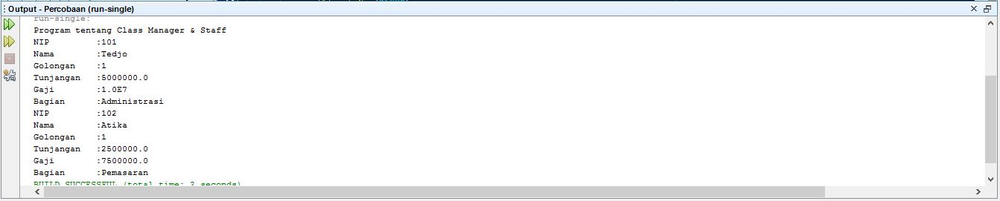
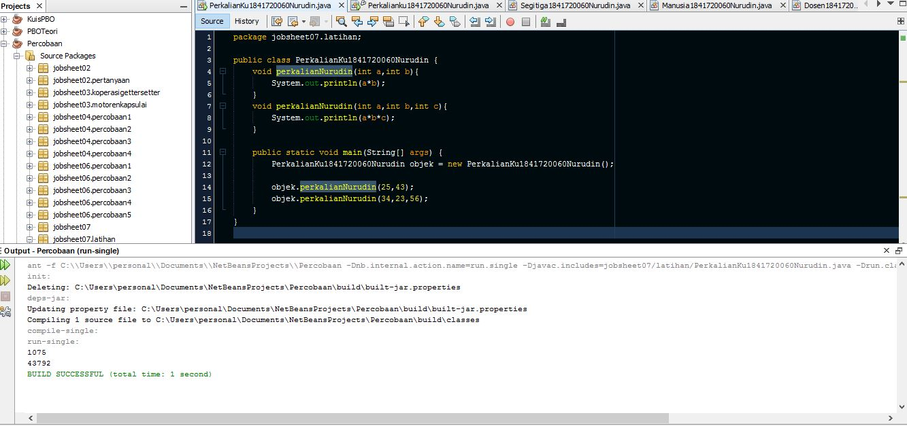
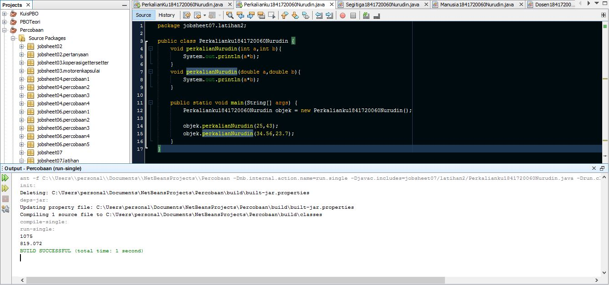
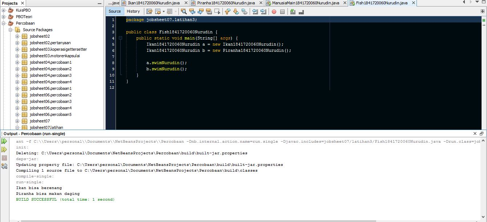
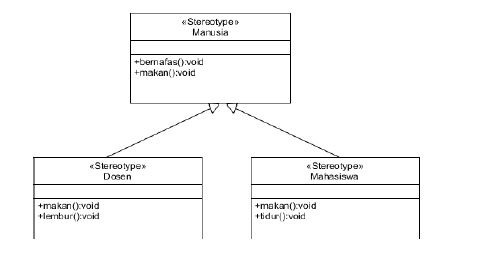
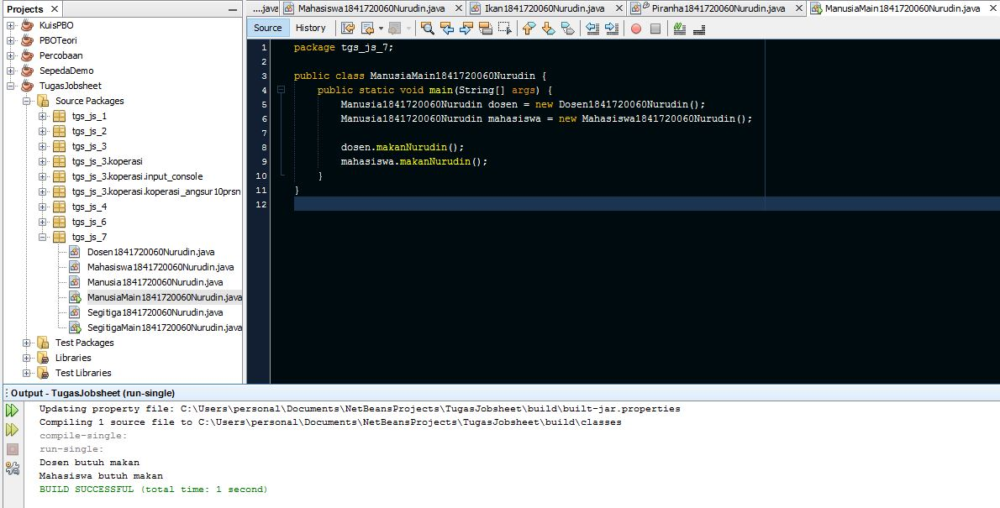

# Laporan Praktikum #7 - Overloading Dan Overriding

## Kompetensi
Setelah menempuh pokok bahasan ini, mahasiswa mampu :
1. Memahami konsep overloading dan overriding,
2. Memahami perbedaan overloading dan overriding,
3. Ketepatan dalam mengidentifikasi method overriding dan overloading
4. Ketepatan dalam mempraktekkan instruksi pada jobsheet
5. Mengimplementasikan method overloading dan overriding.
## Ringkasan Materi
Overloading adalah menuliskan kembali method dengan nama yang sama pada suatu class untuk mempermudah pemanggilan method dengan fungsionalitas yang mirip

Aturan penulisan Overloading :
- Nama method harus sama
- Parameter method harus berbeda
- return type boleh sama dan berbeda

Penjelasan tentang aturan penggunaan parameter pada overloading :
- Jika jumlah parameter berbeda dapat dikatakan memiliki parameter berbeda
- Jika urutan parameter dengan tipe yang berbeda (misal int dengan float) tidak sama maka dianggap parameter berbeda
- Jika menggunakan parameter dengan tipe data yang sama namun urutan nama variabel parameter berbeda, maka dianggap bukan parameter berbeda


Overloading juga bisa terjadi antara parent class dengan subclass-nya jika memenuhi ketiga syarat overload. Ada beberapa aturan overloading yaitu :
- Primitive widening conversion (konversi nilai tipe data primitive) didahulukan dalam overloading dibandingkan boxing dan var args.
- Kita tidak dapat melakukan proses widening dari tipe wrapper ke tipe wrapper lainnya (mengubah Integer ke Long).
- Kita tidak dapat melakukan proses widening dilanjutkan boxing (dari int menjadi Long)
- Kita dapat melakukan boxing dilanjutkan dengan widening (int dapat menjadi Object melalui Integer)
- Kita dapat menggabungkan var args dengan salah satu yaitu widening atau boxing

overriding adalah Sublass yang berusaha memodifkasi tingkah laku yang diwarisi dari superclass. Tujuannya subclass dapat memiliki tingkah laku yang lebih spesifik sehingga dapat dilakukan dengan cara mendeklarasikan kembali method milik parent class di subclass.

Aturan penulisan dan penggunaan Overriding :
- Nama method harus sama
- Parameter method harus sama
- return type harus sama
- Mode akses overriding method harus sama atau lebih luas dari pada overridden method.
- Subclass hanya boleh meng-override method superclass satu kali saja, tidak boleh ada lebih dari satu method pada kelas yang sama persis.
- Overriding method tidak boleh throw checked exceptions yang tidak dideklarasikan oleh overridden method.


## Percobaan

Untuk kasus contoh berikut ini, terdapat tiga kelas, yaitu Karyawan, Manager,dan Staff. Class Karyawan merupakan superclass dari Manager dan Staff dimana subclass Manager dan Staff memiliki method untuk menghitung gaji yang berbeda.

- class Karyawan1841720060Nurudin
```java
package jobsheet07;

public class Karyawan1841720060Nurudin {
    private String mNama,mNip,mGolongan;
    private double mGaji;

    public String getmNama() {
        return mNama;
    }

    public void setmNama(String mNama) {
        this.mNama = mNama;
    }

    public String getmNip() {
        return mNip;
    }

    public void setmNip(String mNip) {
        this.mNip = mNip;
    }

    public String getmGolongan() {
        return mGolongan;
    }

    public void setmGolongan(String mGolongan) {
        this.mGolongan = mGolongan;
        
        switch(mGolongan.charAt(0)){
            case '1':
                this.mGaji = 5000000;
                break;
            case '2' :
                this.mGaji = 3000000;
                break;
            case '3' :
                this.mGaji = 2000000;
                break;
            case '4' :
                this.mGaji = 1000000;
                break;
            case '5' :
                this.mGaji = 750000;
                break;    
        }
    }

    public double getmGaji() {
        return mGaji;
    }

    public void setmGaji(double mGaji) {
        this.mGaji = mGaji;
    }
}
```

Link kode program :[Karyawan1841720060Nurudin](../../src/7_Overriding_dan_Overloading/percobaan/Karyawan1841720060Nurudin.java)

- Class Staff1841720060Nurudin
```java
package jobsheet07;

public class Staff1841720060Nurudin extends Karyawan1841720060Nurudin {
    private int mLembur;
    private double mGajiLembur;

    public int getmLembur() {
        return mLembur;
    }

    public void setmLembur(int mLembur) {
        this.mLembur = mLembur;
    }

    public double getmGajiLembur() {
        return mGajiLembur;
    }

    public void setmGajiLembur(double mGajiLembur) {
        this.mGajiLembur = mGajiLembur;
    }
    
    public double getmGaji(int lembur, double gajiLembur){
        return super.getmGaji()+lembur*gajiLembur;
    }
    
    public double getmGaji(){
       return super.getmGaji()+mLembur*mGajiLembur;
    }
    
    public void lihatInfoNurudin(){
        System.out.println("NIP\t\t: "+this.getmNip());
        System.out.println("Nama\t\t: "+this.getmNama());
        System.out.println("Golongan    : "+this.getmGolongan());
        System.out.println("Jml Lembur  : "+this.getmLembur());
        System.out.printf("Gaji Lembur  :%.0f\n",this.getmGajiLembur());
        System.out.printf("Gaji\t\t:%.0f\n ",this.getmGaji());
    }
}

```
Link kode program :[Staff1841720060Nurudin](../../src/7_Overriding_dan_Overloading/percobaan/Staff1841720060Nurudin.java)

- Class Manager1841720060Nurudin
```java
package jobsheet07;

public class Manager1841720060Nurudin extends Karyawan1841720060Nurudin{
    private double mTunjangan;
    private String mBagian;
    private Staff1841720060Nurudin st[];

    public double getmTunjangan() {
        return mTunjangan;
    }

    public void setmTunjangan(double mTunjangan) {
        this.mTunjangan = mTunjangan;
    }

    public String getmBagian() {
        return mBagian;
    }

    public void setmBagian(String mBagian) {
        this.mBagian = mBagian;
    }

    public void setSt(Staff1841720060Nurudin[] st) {
        this.st = st;
    }
    
    public void viewStaffNurudin(){
        int i;
        System.out.println("-------------------------");
        for (i = 0; i < st.length; i++) {
            Staff1841720060Nurudin staff1841720060Nurudin = st[i];
        }
        System.out.println("-------------------------");
    }
    
    public void lihatInfoNurudin(){
        System.out.println("NIP         :"+this.getmNip());
        System.out.println("Nama        :"+this.getmNama());
        System.out.println("Golongan    :"+this.getmGolongan());
        System.out.println("Tunjangan   :"+this.getmTunjangan());
        System.out.println("Gaji        :"+this.getmGaji());
        System.out.println("Bagian      :"+this.getmBagian());
    }
    
    public double getmGaji(){
        return super.getmGaji()+mTunjangan;
    }
}
```

Link kode program :[Manager1841720060Nurudin](../../src/7_Overriding_dan_Overloading/percobaan/Manager1841720060Nurudin.java)

- Main class
```java
package jobsheet07;

public class Utama1841720060Nurudin {
    public static void main(String[] args) {
        System.out.println("Program tentang Class Manager & Staff");
        Manager1841720060Nurudin man[]= new Manager1841720060Nurudin[2];
        Staff1841720060Nurudin staff1[]= new Staff1841720060Nurudin[2];
        Staff1841720060Nurudin staff2[]= new Staff1841720060Nurudin[3];
        
        man[0] = new Manager1841720060Nurudin();
        man[0].setmNama("Tedjo");
        man[0].setmNip("101");
        man[0].setmGolongan("1");
        man[0].setmTunjangan(5000000);
        man[0].setmBagian("Administrasi");
        
        man[1] = new Manager1841720060Nurudin();
        man[1].setmNama("Atika");
        man[1].setmNip("102");
        man[1].setmGolongan("1");
        man[1].setmTunjangan(2500000);
        man[1].setmBagian("Pemasaran");
        
        staff1[0] = new Staff1841720060Nurudin();
        staff1[0].setmNama("Usman");
        staff1[0].setmNip("0003");
        staff1[0].setmGolongan("2");
        staff1[0].setmLembur(10);
        staff1[0].setmGajiLembur(10000);
        
        staff1[1] = new Staff1841720060Nurudin();
        staff1[1].setmNama("Anugrah");
        staff1[1].setmNip("0005");
        staff1[1].setmGolongan("2");
        staff1[1].setmLembur(10);
        staff1[1].setmGajiLembur(55000);
        man[0].setSt(staff1);
        
        staff2[0] = new Staff1841720060Nurudin();
        staff2[0].setmNama("Hendra");
        staff2[0].setmNip("0004");
        staff2[0].setmGolongan("3");
        staff2[0].setmLembur(15);
        staff2[0].setmGajiLembur(5500);
        
        staff2[1] = new Staff1841720060Nurudin();
        staff2[1].setmNama("Arie");
        staff2[1].setmNip("0006");
        staff2[1].setmGolongan("4");
        staff2[1].setmLembur(5);
        staff2[1].setmGajiLembur(100000);
        
        staff2[2] = new Staff1841720060Nurudin();
        staff2[2].setmNama("Mentari");
        staff2[2].setmNip("0007");
        staff2[2].setmGolongan("3");
        staff2[2].setmLembur(6);
        staff2[2].setmGajiLembur(20000);
        
        man[1].setSt(staff2);
        
        man[0].lihatInfoNurudin();
        man[1].lihatInfoNurudin();
    }
}
```
Link kode program :[Utama1841720060Nurudin](../../src/7_Overriding_dan_Overloading/percobaan/Utama1841720060Nurudin.java)

Output Program :


### Latihan 
1. Overloading

```java
package jobsheet07.latihan;

public class PerkalianKu1841720060Nurudin {
    void perkalianNurudin(int a,int b){
        System.out.println(a*b);
    }
    void perkalianNurudin(int a,int b,int c){
        System.out.println(a*b*c);
    }
    
    public static void main(String[] args) {
        PerkalianKu1841720060Nurudin objek = new PerkalianKu1841720060Nurudin();
        
        objek.perkalianNurudin(25,43);
        objek.perkalianNurudin(34,23,56);
    }
}

```
Output :



>Pertanyaan
>1.  Dari source coding diatas terletak dimanakah overloading?
>2.  Jika terdapat overloading ada berapa jumlah parameter yang berbeda?
>
>Jawab
>1.   Terletak pada method perkalianNurudin yang kedua karena terdapat nama method sama dengan nama method awal namun paraneter yang berbeda
>2.   Ada satu yaitu penambahan parameter int c  

2. Overloading

```java
package jobsheet07.latihan2;

public class Perkalianku1841720060Nurudin {
    void perkalianNurudin(int a,int b){
        System.out.println(a*b);
    }
    void perkalianNurudin(double a,double b){
        System.out.println(a*b);
    }
    
    public static void main(String[] args) {
        Perkalianku1841720060Nurudin objek = new Perkalianku1841720060Nurudin();
        
        objek.perkalianNurudin(25,43);
        objek.perkalianNurudin(34.56,23.7);
    }
}
```
Output :


>Pertanyaan
>1.  Dari source coding diatas terletak dimanakah overloading?
>2.  Jika terdapat overloading ada berapa jumlah parameter yang berbeda?
>
>Jawab
>
>1.   Terletak pada method perkalianNurudin yang kedua karena terdapat nama method sama dengan nama method awal namun paraneter yang berbeda
>2.   ada dua yaitu parameter bertipe int diganti menjadi double (double a, double b)


3. Overriding

-    Class Ikan1841720060Nurudin

```Java
package jobsheet07.latihan3;

public class Ikan1841720060Nurudin {
    public void swimNurudin(){
        System.out.println("Ikan bisa berenang");
    }
}
```

-    Class Piranha1841720060Nurudin

```Java
package jobsheet07.latihan3;

public class Piranha1841720060Nurudin extends Ikan1841720060Nurudin{
    @Override
    public void swimNurudin(){
        System.out.println("Piranha bisa makan daging");
    }
}
```
-    Main class

```java
package jobsheet07.latihan3;

public class Fish1841720060Nurudin {
    public static void main(String[] args) {
        Ikan1841720060Nurudin a = new Ikan1841720060Nurudin();
        Ikan1841720060Nurudin b = new Piranha1841720060Nurudin();
        
        a.swimNurudin();
        b.swimNurudin();
    }
}
```
Output :



>Pertanyaan
>1.  Dari source coding diatas terletak dimanakah overriding?
>2.  Jabarkanlah apabila source coding diatas jika terdapat overriding?
>
>Jawab
>
>1.   Terletak pada method swimNurudin() dimana pada class parent berisi "Ikan bisa berenang" kemudian method tersebut dipanggil lagi pada class child dan berisi "Piranha bisa makan daging"
>2.   Saya kurang paham kalimat dari soalnya. 
          Pada sourcecode diatas terdapat overriding pada method swimNurudin().
          Dikarenakan telah memenuhi syarat-syarat atau ciri bahwa telah dilakukan overriding. 
          Yaitu nama method dan parameter pada child class sama persis dengan milik parent class. 
          Kemudian isi dari methodnya di override atau diubah  

## Tugas

Implementasikan class diagram dibawah ini dengan menggunakan teknik dynamic method dispatch :



### Jawab

1. Membuat Class Manusia1841720060Nurudin
```java
package tgs_js_7;

public class Manusia1841720060Nurudin {
    public void bernafasNurudin(){
    }
    
    public void makanNurudin(){
    }
}
```
2. Membuat Class Dosen1841720060Nurudin
```java
package tgs_js_7;

public class Dosen1841720060Nurudin extends Manusia1841720060Nurudin{

    @Override
    public void makanNurudin() {
        System.out.println("Dosen butuh makan");
    }
    
    public void lemburNurudin(){
        System.out.println("Dosen wajib lembur");
    }
}

```
3. Membuat Class Mahasiswa1841720060Nurudin
```java
package tgs_js_7;

public class Mahasiswa1841720060Nurudin extends Manusia1841720060Nurudin{
    @Override
    public void makanNurudin(){
        System.out.println("Mahasiswa butuh makan");
    }
    public void tidurNurudin(){
        System.out.println("Mahasiswa wajib tidur");
    }
}
```
4. Main class
```java
package tgs_js_7;

public class ManusiaMain1841720060Nurudin {
    public static void main(String[] args) {
        Manusia1841720060Nurudin dosen = new Dosen1841720060Nurudin();
        Manusia1841720060Nurudin mahasiswa = new Mahasiswa1841720060Nurudin();
        
        dosen.makanNurudin();
        mahasiswa.makanNurudin();
    }
}
```
Output :




## Kesimpulan

Overloading diterapkan untuk mempermudah pemanggilan method dengan fungsionalitas yang mirip sedangkan overriding digunakan untuk mengubah isi method pada parent class agar lebih spesifik dan sesuai untuk behaviour di child class.

Pada pemanggilan object juga bisa dilakukan  dengan menggunakan teknik dynamic method dispatch yaitu mengubah method yang beradap pada parent class dengan isi method milik child class dengan notasi 
```java
ParentClass = new ChildClass();
```

## Pernyataan Diri

Saya menyatakan isi tugas, kode program, dan laporan praktikum ini dibuat oleh saya sendiri. Saya tidak melakukan plagiasi, kecurangan, menyalin/menggandakan milik orang lain.

Jika saya melakukan plagiasi, kecurangan, atau melanggar hak kekayaan intelektual, saya siap untuk mendapat sanksi atau hukuman sesuai peraturan perundang-undangan yang berlaku.

Ttd,

***(Mukhammad Nuruddin Ismail)***
