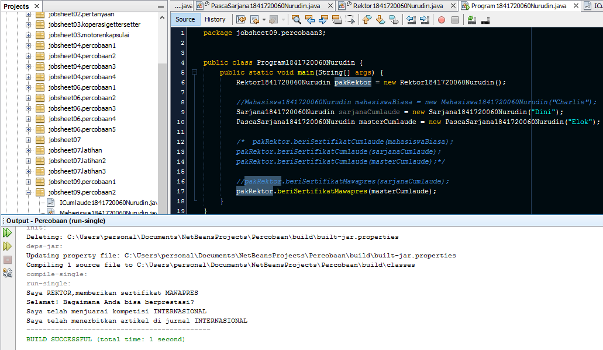

# Laporan Praktikum #9 - Abstract Class dan Interface

## Kompetensi

1. Menjelaskan maksud dan tujuan penggunaan Abstract Class.
2. Menjelaskan maksud dan tujuan penggunaan Interface.
3. Menerapkan Abstract Class dan Interface di dalam pembuatan program.

## Ringkasan Materi

>Abstract Class

Abstract Class adalah class yang tidak dapat diinstansiasi namun dapat di-extend. Abstract class baru
dapat dimanfaatkan ketika ia di-extend.

>Karakteristik:
- Dapat memiliki properties dan methods seperti class biasa.
- Selalu memiliki methods yang tidak memiliki tubuh (hanya deklarasinya saja, disebut juga abstract method.
- Selalu dideklarasikan dengan menggunakan kata kunci abstract class.

>Interface

Interface adalah struktur data yang hanya berisi abstract methods. Tidak ada apa-apa selain method
abstract pada interface, termasuk atribut getter dan setter.

>Karakteristik:
- Tidak ada apa-apa di dalamnya selain abstract methods.
- Di konvensi bahasa pemrograman Java, namanya dianjurkan untuk selalu diawali dengan huruf
kapital ‘I’.
- Selalu dideklarasikan dengan menggunakan kata kunci interface.
- Diimplementasikan dengan menggunakan kata kunci implements.

## Percobaan
### Percobaan 1: Abstract Class


Di dunia ini terdapat banyak jenis hewan. Semua hewan memiliki beberapa karakteristik yang sama, seperti contohnya semua hewan memiliki umur, hewan apapun itu, umurnya akan bertambah sama jumlahnya setiap tahun.
Selain karakteristik yang sama, masing-masing hewan juga memiliki karakteristik yang berbeda satu dengan yang lainnya. Contohnya dalam hal bergerak. Cara kucing bergerak berbeda dengan cara ikan bergerak. Kucing bergerak dengan cara melangkahkan kaki-kakinya sedangkan ikan bergerak dengan cara menggerakkan siripnya. Setiap orang yang memelihara hewan dapat mengajak hewan peliharaannya berjalan (membuat agar hewan peliharaannya bergerak). Namun orang yang memelihara hewan yang berbeda, akan berbeda pula cara hewan peliharaannya dalam bergerak.

Pada percobaan pertama ini kita akan membuat sebuah program yang menggambarkan skenario di atas dengan memanfaatkan abstract class.

> Class Hewan1841720060Nurudin


Link kode program : [kode program](../../src/9_Abstract_Class_dan_Interface/percobaan1/Hewan1841720060Nurudin.java)

> Class Kucing1841720060Nurudin


Link kode program : [kode program](../../src/9_Abstract_Class_dan_Interface/percobaan1/Kucing1841720060Nurudin.java)

> Class Ikan1841720060Nurudin


Link kode program : [kode program](../../src/9_Abstract_Class_dan_Interface/percobaan1/Ikan1841720060Nurudin.java)

> Class Orang1841720060Nurudin


Link kode program : [kode program](../../src/9_Abstract_Class_dan_Interface/percobaan1/Orang1841720060Nurudin.java)

> Class Program1841720060Nurudin (main)


Link kode program : [kode program](../../src/9_Abstract_Class_dan_Interface/percobaan1/Program1841720060Nurudin.java)

#### Pertanyaan Diskusi

Bolehkah apabila sebuah class yang meng-extend suatu abstract class tidak mengimplementasikan method abstract yang ada di class induknya? Buktikan!

**Jawab**
Tidak bisa, method abstrak wajib di implementasikan juga ketika melakukan extend pada class abstrak.

Dibuktikan ketika menghapus method abstrak **bergerakNurudin()** pada class Ikan1841720060Nurudin muncul pesan error, bahwa class Ikan1841720060Nurudin tidak memanggil method **bergerakNurudin()**


### Percobaan 2: Interface


Pada sebuah wisuda, seorang Rektor akan memberikan penghargaan sertifikat Cumlaude pada semua mahasiswa yang memenuhi persyaratan. Persyaratan agar seorang mahasiswa dapat disebut sebagai Cumlaude berbeda-beda antara mahasiswa Sarjana dan Pasca Sarjana. Untuk menjadi cumlaude, mahasiswa Sarjana harus mengerjakan skripsi dan memiliki IPK lebih tinggi dari 3,51. Sedangkan untuk mahasiswa Pasca Sarjana, mereka harus mengerjakan tesis dan meraih IPK lebih tinggi dari 3,71.

Pada percobaan ini kita akan mencoba menerjemahkan skenario di atas ke dalam sebuah aplikasi sederhana yang memanfaatkan interface.

> Interface ICumlaude1841720060Nurudin


Link kode program : [kode program](../../src/9_Abstract_Class_dan_Interface/percobaan2/ICumlaude1841720060Nurudin.java)

> Class Mahasiswa1841720060Nurudin


Link kode program : [kode program](../../src/9_Abstract_Class_dan_Interface/percobaan2/Mahasiswa1841720060Nurudin.java)

> Class Sarjana1841720060Nurudin


Link kode program : [kode program](../../src/9_Abstract_Class_dan_Interface/percobaan2/Sarjana1841720060Nurudin.java)

> Class PascaSarjana1841720060Nurudin


Link kode program : [kode program](../../src/9_Abstract_Class_dan_Interface/percobaan2/PascaSarjana1841720060Nurudin.java)

> Class Rektor1841720060Nurudin


Link kode program : [kode program](../../src/9_Abstract_Class_dan_Interface/percobaan2/Rektor1841720060Nurudin.java)

> Class Program1841720060Nurudin


Link kode program : [kode program](../../src/9_Abstract_Class_dan_Interface/percobaan2/Program1841720060Nurudin.java)

#### Pertanyaan Diskusi

1. Mengapa pada langkah nomor 9 terjadi error? Jelaskan!
2. Dapatkah method kuliahDiKampus() dipanggil dari objek sarjanaCumlaude di class Program? Mengapa demikian?
3. Dapatkah method kuliahDiKampus() dipanggil dari parameter mahasiswa di method beriSertifikatCumlaude() pada class Rektor? Mengapa demikian?
4. Modifikasilah method beriSertifikatCumlaude() pada class Rektor agar hasil eksekusi class Program menjadi seperti berikut ini:

    

**Jawab**
1. Karena class Mahasiswa1841720060Nurudin tidak mengimplement interface ICumlaude1841720060Nurudin
2. Bisa, karena method kuliahDiKampusNurudin() berada di class Mahasiswa1841720060Nurudin dan objek sarjanaCumlaude adalah instansiasi dari class Sarjana1841720060Nurudin yang mengextend class Mahasiswa1841720060Nurudin
3. Tidak bisa, karena pada class Rektor1841720060Nurudin tidak memiliki relasi dengan class Mahasiswa1841720060Nurudin sehingga tidak dapat memanggil method yang ada dalam class Mahasiswa1841720060Nurudin
4. - class Rektor1841720060Nurudin
    ```java
    package jobsheet09.percobaan2;

    public class Rektor1841720060Nurudin{

        public void beriSertifikatCumlaude(ICumlaude1841720060Nurudin Mahasiswa,Mahasiswa1841720060Nurudin m){
        System.out.println("Saya REKTOR, memberikan sertifikat cumlaude.");
        System.out.println("Selamat! silahkan perkenalkan diri Anda..");
        m.kuliahDikampusNurudin();
        Mahasiswa.lulusNurudin();
        Mahasiswa.meraihIPKTinggiNurudin();
        System.out.println("--------------------------------------------");
        }
    }

    ```
    - class Program1841720060Nurudin
    ```java
    package jobsheet09.percobaan2;

    public class Program1841720060Nurudin {
        public static void main(String[] args) {
            Rektor1841720060Nurudin pakRektor = new Rektor1841720060Nurudin();
            
            Mahasiswa1841720060Nurudin mahasiswaBiasa = new Mahasiswa1841720060Nurudin("Charlie");
            Sarjana1841720060Nurudin sarjanaCumlaude = new Sarjana1841720060Nurudin("Dini");
            PascaSarjana1841720060Nurudin masterCumlaude = new PascaSarjana1841720060Nurudin("Elok");
            
            /*  pakRektor.beriSertifikatCumlaude(mahasiswaBiasa);*/
            pakRektor.beriSertifikatCumlaude(sarjanaCumlaude,sarjanaCumlaude);
            pakRektor.beriSertifikatCumlaude(masterCumlaude,masterCumlaude);
        }
    }

    ``` 
    - Output :

    

### Percobaan 3: Multiple Interfaces Implementation


Pada percobaan kali ini kita akan memodifikasi program yang telah dibuat pada Percobaan 2 sehingga pada program tersebut nantinya akan terdapat sebuah class yang meng-implements lebih dari 1 interface.
Bayangkan pada skenario sebelumnya, dimana seorang rektor juga akan mem-**beriSertifikatMawapres()** pada sebuah acara wisuda. Mahasiswa yang berhak menerima penghargaan tersebut tentunya adalah mahasiswa yang berprestasi, dimana kriteria prestasi di sini berbeda antara mahasiswa Sarjana dengan mahasiswa Pasca Sarjana. Pada percobaan ini, kita akan menentukan kriteria prestasi yaitu: harus **menjuaraiKompetisi()** dan **membuatPublikasiIlmiah()**.

> Interface IBerprestasi1841720060Nurudin


Link kode program : [kode program](../../src/9_Abstract_Class_dan_Interface/percobaan3/IBerprestasi1841720060Nurudin.java)

> Modifikasi class PascaSarjana1841720060Nurudin

```java
package jobsheet09.percobaan3;

public class PascaSarjana1841720060Nurudin extends Mahasiswa1841720060Nurudin implements ICumlaude1841720060Nurudin, IBerprestasi1841720060Nurudin {

    public PascaSarjana1841720060Nurudin(String nama) {
        super(nama);
    }

    @Override
    public void menjuaraiKompetisiNurudin() {
        System.out.println("Saya telah menjuarai kompetisi INTERNASIONAL");
    }

    @Override
    public void membuatPublikasiIlmiahNurudin() {
        System.out.println("Saya telah menerbitkan artikel di jurnal INTERNASIONAL");
    }

    @Override
    public void lulusNurudin() {
        throw new UnsupportedOperationException("Not supported yet."); //To change body of generated methods, choose Tools | Templates.
    }

    @Override
    public void meraihIPKTinggiNurudin() {
        throw new UnsupportedOperationException("Not supported yet."); //To change body of generated methods, choose Tools | Templates.
    }
}
```

> Modifikasi class Rektor1841720060Nurudin

Menambahkan method **beriSertifikatMawapresNurudin()**
```java
package jobsheet09.percobaan3;

public class Rektor1841720060Nurudin {
    public void beriSertifikatCumlaude(ICumlaude1841720060Nurudin Mahasiswa1841720060Nurudin){
        System.out.println("Saya REKTOR, memberikan sertifikat cumlaude.");
        System.out.println("Selamat! silahkan perkenalkan diri Anda..");
        
        Mahasiswa1841720060Nurudin.lulusNurudin();
        Mahasiswa1841720060Nurudin.meraihIPKTinggiNurudin();
        
        System.out.println("--------------------------------------------");
    }
    
    public void beriSertifikatMawapres(IBerprestasi1841720060Nurudin Mahasiswa1841720060Nurudin){
        System.out.println("Saya REKTOR,memberikan sertifikat MAWAPRES");
        System.out.println("Selamat! Bagaimana Anda bisa berprestasi?");
        
        Mahasiswa1841720060Nurudin.menjuaraiKompetisiNurudin();
        Mahasiswa1841720060Nurudin.membuatPublikasiIlmiahNurudin();
        
        System.out.println("---------------------------------------------");
    }
}
```

> Modifikasi class Program1841720060Nurudin

Memodifikasi class Program1841720060Nurudin dan memperbaiki error hingga menghasilkan output :


Kode Program Class Program1841720060Nurudin :

```java
package jobsheet09.percobaan3;


public class Program1841720060Nurudin {
    public static void main(String[] args) {
        Rektor1841720060Nurudin pakRektor = new Rektor1841720060Nurudin();
        
        //Mahasiswa1841720060Nurudin mahasiswaBiasa = new Mahasiswa1841720060Nurudin("Charlie");
        Sarjana1841720060Nurudin sarjanaCumlaude = new Sarjana1841720060Nurudin("Dini");
        PascaSarjana1841720060Nurudin masterCumlaude = new PascaSarjana1841720060Nurudin("Elok");
        
        /*  pakRektor.beriSertifikatCumlaude(mahasiswaBiasa);
        pakRektor.beriSertifikatCumlaude(sarjanaCumlaude);
        pakRektor.beriSertifikatCumlaude(masterCumlaude);*/
        
        //pakRektor.beriSertifikatMawapres(sarjanaCumlaude);
        pakRektor.beriSertifikatMawapres(masterCumlaude);
    }
}
```

Output :



#### Pertanyaan Diskusi

Apabila Sarjana Berprestasi harus menjuarai kompetisi NASIONAL dan membuat artikel di jurnal NASIONAL, maka modifikasilah class-class yang terkait pada aplikasi Anda agar di class Program objek pakRektor dapat memberikan sertifikat mawapres pada objek sarjanaCumlaude.


**Jawab**
Hal tersebut di soal dapat dilakukan dengan mengimplementkan interface IBerprestasi1841720060Nurudin dalam class Sarjana1841720060Nurudin kemudian melakukan overriding method menjuaraiKompetisiNurudin() dan membuatPublikasiIlmiahNurudin() 

- class Sarjana1841720060Nurudin
```java
package jobsheet09.percobaan3;

public class Sarjana1841720060Nurudin extends Mahasiswa1841720060Nurudin implements ICumlaude1841720060Nurudin,IBerprestasi1841720060Nurudin{

    public Sarjana1841720060Nurudin(String nama) {
        super(nama);
    }

    @Override
    public void lulusNurudin() {
        System.out.println("Aku sudah menyelesaikan SKRIPSI");  
    }

    @Override
    public void meraihIPKTinggiNurudin() {
        System.out.println("IPK-ku lebih dari 3,51");  
    }

    @Override
    public void menjuaraiKompetisiNurudin() {
        System.out.println("Menjuarai kompetisi NASIONAL");
    }

    @Override
    public void membuatPublikasiIlmiahNurudin() {
        System.out.println("Menerbitkan Jurnal NASIONAL");
    }
}

```

- class Program1841720060Nurudin (Main)
```java
package jobsheet09.percobaan3;


public class Program1841720060Nurudin {
    public static void main(String[] args) {
        Rektor1841720060Nurudin pakRektor = new Rektor1841720060Nurudin();
        
        //Mahasiswa1841720060Nurudin mahasiswaBiasa = new Mahasiswa1841720060Nurudin("Charlie");
        Sarjana1841720060Nurudin sarjanaCumlaude = new Sarjana1841720060Nurudin("Dini");
        PascaSarjana1841720060Nurudin masterCumlaude = new PascaSarjana1841720060Nurudin("Elok");
        
        /*  pakRektor.beriSertifikatCumlaude(mahasiswaBiasa);
        pakRektor.beriSertifikatCumlaude(sarjanaCumlaude);
        pakRektor.beriSertifikatCumlaude(masterCumlaude);*/
        
        pakRektor.beriSertifikatMawapres(sarjanaCumlaude);
        pakRektor.beriSertifikatMawapres(masterCumlaude);
    }
}

```

- Output :


## Kesimpulan

Penggunaan Abstrak Class dan Interface hampir mirip yaitu semacam template bahwa jika sebuah class merupakan bagian dari class abstrak atau interface tersebut maka akan mewarisi method yang ada di class absrtak atau interface. Sehingga memudahkan programmer dalam pembuatan class baru yang merupakan bagian dari class abstrak karena tidak perlu menganalisis terlalu dalam tentang method yang perlu disediakan.

## Pernyataan Diri

Saya menyatakan isi tugas, kode program, dan laporan praktikum ini dibuat oleh saya sendiri. Saya tidak melakukan plagiasi, kecurangan, menyalin/menggandakan milik orang lain.

Jika saya melakukan plagiasi, kecurangan, atau melanggar hak kekayaan intelektual, saya siap untuk mendapat sanksi atau hukuman sesuai peraturan perundang-undangan yang berlaku.

Ttd,

***(Mukhammad Nuruddin Ismail)***
